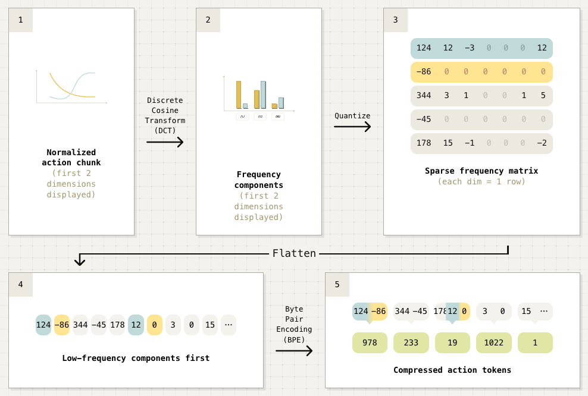

### Author's Note

- **Discrete Action Token + Compression Potential**. Shows that even with discrete action tokens, good compression can shorten pretraining time.
- **Maximizing LLM Capabilities**. Autoregressive structure allows better leveraging of LLM's language understanding abilities.
- **Advantageous for Research Stage**. Has the drawback of slow inference, making it more suitable for research/training phases rather than actual deployment.

## Key Significance

- **Breakthrough DCT + BPE Compression**: Combines DCT (used in JPEG/MP3) with BPE (LLM tokenizers) to achieve approximately 10x compression
- **5x Faster VLA Training**: Dramatically reduced training time compared to diffusion-based models
- **High-Frequency Dexterous Task Support**: Enables learning of high-frequency precise manipulation tasks impossible with standard binning
- **Diffusion-Level Dexterity**: Achieves similar levels of dexterity as flow matching/diffusion approaches
- **Improved Language Instruction Following**: Autoregressive structure better transfers internet-scale pretraining language understanding
- **Universal Tokenizer FAST+**: Trained on 1 million real robot trajectories, immediately applicable to diverse action spaces/frequencies

---

## Overview

FAST (Frequency-space Action Sequence Tokenization) is a robot action tokenizer published by Physical Intelligence in January 2025. It overcomes the limitations of simple per-dimension binning used by existing VLA models, enabling effective autoregressive model training even on high-frequency dexterous manipulation tasks.

| Item | Details |
|------|---------|
| Published | January 16, 2025 |
| Company | Physical Intelligence |
| Paper | [arXiv:2501.09747](https://arxiv.org/abs/2501.09747) |
| Blog | [pi.website/research/fast](https://www.pi.website/research/fast) |
| Model | [HuggingFace: physical-intelligence/fast](https://huggingface.co/physical-intelligence/fast) |

---

## Why FAST is Needed

### Problems with Existing Tokenization

Existing VLA models (OpenVLA, RT-2, etc.) tokenized robot actions using **per-dimension, per-timestep binning**:

| Problem | Description |
|---------|-------------|
| **Token Explosion** | Generates enormous token sequences at high frequencies (50Hz+) |
| **Dexterous Failure** | Cannot learn high-frequency tasks like precise finger manipulation |
| **Inefficient Training** | Increased training time due to long sequences |
| **Weakened Language Connection** | Gap between action tokens and language tokens |

### FAST's Solution

**Compression-based Approach**: Compress action sequences first, then tokenize

---

## Technical Architecture

<em>FAST Tokenizer: DCT → Quantize → Flatten → BPE Compression Process</em>

### 5-Stage Compression Pipeline

| Stage | Name | Description |
|-------|------|-------------|
| 1 | **Normalized Action Chunk** | Normalize raw action sequence |
| 2 | **DCT (Discrete Cosine Transform)** | Time domain → frequency domain transform (same principle as JPEG/MP3) |
| 3 | **Quantize** | Quantize frequency components to discrete values → Sparse frequency matrix |
| 4 | **Flatten** | Flatten to 1D array with low-frequency components first |
| 5 | **BPE (Byte Pair Encoding)** | Merge frequent patterns into new tokens for final compression |

> **Note**: This is a lossy compression approach where information loss occurs at the Quantization stage. Similar to JPEG image compression, it achieves higher compression ratios by discarding some high-frequency components.

### Compression Results

| Metric | Value |
|--------|-------|
| **Compression Ratio** | ~10x |
| **Tokens per Chunk** | 30-60 |
| **Implementation Complexity** | 3 lines of code |

---

## FAST+ Universal Tokenizer

### Training Data

| Item | Details |
|------|---------|
| Training Data | 1 million real robot trajectories |
| Data Sources | Various robot platforms |
| Action Spaces | Various DoF, control frequencies |

### Features

- **Zero-shot Application**: Immediately usable on new robots
- **Universality**: Supports various action spaces and control frequencies
- **Pre-trained**: No separate tokenizer training required

---

## Performance Comparison

### vs Diffusion/Flow Matching Based VLA

| Item | FAST (Autoregressive) | Diffusion/Flow Matching |
|------|----------------------|------------------------|
| **Training Speed** | **5x faster** | Baseline |
| **Dexterity** | Similar level | Similar level |
| **Inference Speed** | Slower (autoregressive) | **Faster** |
| **Language Understanding** | **Better** | Baseline |

### Validated Tasks

Complex manipulation tasks successfully performed by FAST-trained policies:

| Task | Description |
|------|-------------|
| Laundry folding | Folding clothes and towels |
| Table bussing | Clearing and organizing tables |
| Grocery bagging | Packing groceries into bags |

### DROID Dataset Results

- **First Zero-shot Generalization**: First generalist policy trained on DROID dataset
- **Multi-environment Deployment**: Validated at UC Berkeley, Stanford, University of Washington

---

## Pi0-FAST Integration

Variant model applying FAST to [Pi0](pi0):

| Feature | Pi0 (Flow Matching) | Pi0-FAST (Autoregressive) |
|---------|-------------------|-------------------------|
| Action Generation | Flow matching | FAST token autoregressive |
| Training Speed | Baseline | **5x faster** |
| Inference Cost | Baseline | 4-5x higher |
| Language Understanding | Good | **Better** |

---

## Limitations

### Inference Speed

| Issue | Description |
|-------|-------------|
| **Autoregressive Decoding** | Tokens must be generated sequentially |
| **Slower than Pi0** | Slower than flow matching's parallel decoding |
| **Increased Inference Cost** | Consideration needed for real-time control |

### Suitable Use Cases

- Research environments where training time is critical
- Tasks where language instruction understanding is important
- Offline batch training

---

## Technical Details

### Authors

| Name | Affiliation |
|------|-------------|
| Karl Pertsch | Physical Intelligence |
| Kyle Stachowicz | Physical Intelligence |
| Brian Ichter | Physical Intelligence |
| Danny Driess | Physical Intelligence |
| Suraj Nair | Physical Intelligence |
| Quan Vuong | Physical Intelligence |
| Oier Mees | Physical Intelligence |
| [Chelsea Finn](../people/chelsea-finn) | Physical Intelligence |
| [Sergey Levine](../people/sergey-levine) | Physical Intelligence |

### Scaling

| Item | Value |
|------|-------|
| Training Data | 10,000+ hours |
| Robot Trajectories | 1M+ |
| Supported Robots | Various platforms |

---

## References

- [Physical Intelligence Blog - FAST](https://www.pi.website/research/fast)
- [arXiv Paper](https://arxiv.org/abs/2501.09747)
- [HuggingFace - FAST](https://huggingface.co/physical-intelligence/fast)
- [GitHub - openpi](https://github.com/Physical-Intelligence/openpi)

---

## See Also

- [Pi0](pi0) - Flow Matching based model (base for Pi0-FAST)
- [Pi Series](pi-series) - Physical Intelligence model series
- [Pi0.5](pi0-5) - Open-world generalization version
- [Physical Intelligence](../companies/physical-intelligence) - Company information
- [Diffusion Policy](diffusion-policy) - Comparison: Diffusion-based policy

### Related People

- [Chelsea Finn](../people/chelsea-finn) - Physical Intelligence Co-founder
- [Sergey Levine](../people/sergey-levine) - Physical Intelligence Co-founder
