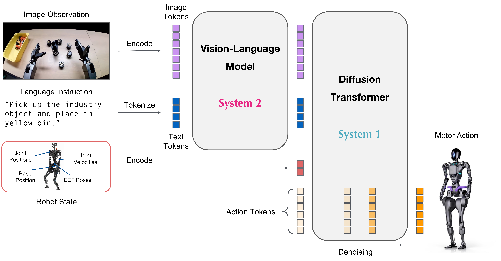
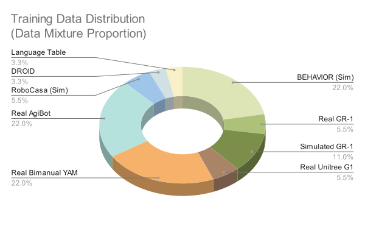

### Author's Note

- **Textbook scale-up**. DiT doubled (16→32 layers), VLM upgraded from Eagle to Cosmos. Shows that bigger models produce smoother, more accurate motions.
- **Relative Action Space introduced**. Predicts relative actions from current state instead of absolute coordinates. More robust to position changes with less jittery movements.
- **Full loco-manipulation support**. Added whole-body motion data with Unitree G1 walking while manipulating. Directly addresses the core humanoid use case.

## Key Significance

- **2x DiT Expansion**: Diffusion Transformer scale expansion from 16 to 32 layers
- **Cosmos VLM Introduction**: VLM changed from Eagle to Cosmos-Reason-2B, enhanced reasoning capability
- **Relative Action Space**: Improved generalization and adaptability with relative action space
- **Sim-to-Real Performance Improvement**: Improved zero-shot simulation-to-real-world transfer
- **Loco-manipulation Support**: Supports whole-body motion combining locomotion and manipulation

---

## Overview

| Item | Details |
|------|---------|
| Announced | September 29, 2025 (CoRL 2025, Seoul) |
| Type | Vision-Language-Action (VLA) |
| Parameters | 3B |
| VLM | [Cosmos](cosmos)-Reason-2B |
| DiT | **32 layers** (2x compared to N1.5) |
| Action Space | Relative Action Space |
| GitHub | [NVIDIA/Isaac-GR00T](https://github.com/NVIDIA/Isaac-GR00T) |
| Hugging Face | [nvidia/GR00T-N1.6-3B](https://huggingface.co/nvidia/GR00T-N1.6-3B) |

---

## Key Improvements over N1.5

### 1. DiT Layer Expansion (16 → 32)

| Aspect | N1.5 | N1.6 |
|--------|------|------|
| **DiT Layers** | 16 | **32 (2x)** |
| **Effect** | - | Smoother, less jittery movements, easier adaptation to changing positions |

The larger 32-layer Diffusion Transformer, combined with state-relative action prediction, generates more flexible and adaptive motions.

### 2. Cosmos VLM (2B) Introduction

N1.6 uses **NVIDIA Cosmos-Reason-2B VLM** as its base VLM instead of Eagle.

| Aspect | N1.5 | N1.6 |
|--------|------|------|
| VLM | Eagle 2.5 (1B) | **Cosmos-Reason-2B** |
| Parameters | ~1B | **2B (2x)** |
| VLM Training | Fully frozen | **Top 4 layers unfrozen** |
| Adapter | 4-layer transformer | **Removed** |

**Cosmos-Reason Key Features:**
- **Flexible resolution support**: Can encode images at native aspect ratio without padding
- **Deep thinking capability**: Serves as the robot's "deep thinking brain"
- **Ambiguous instruction interpretation**: Converts ambiguous instructions into step-by-step plans using prior knowledge, common sense, and physics

### 3. Relative Action Space

N1.6 **predicts state-relative action chunks instead of absolute joint angles or EEF positions**.

| Aspect | N1/N1.5 | N1.6 |
|--------|---------|------|
| Action Space | Absolute | **Relative** |
| Motion Characteristics | Fixed position based | **Relative to current state** |

**Advantages:**
- Smoother and more accurate motion generation
- Easier adaptation to changing positions
- Less jittery movements

**Caveats:**
- Error accumulation may occur on small datasets, affecting correction capability

---

## Architecture

<em>GR00T N1.6 Model Architecture (Source: <a href="https://research.nvidia.com/labs/gear/gr00t-n1_6/">NVIDIA Research</a>)</em>

### Key Architecture Changes (N1.5 → N1.6)

| Component | N1.5 | N1.6 |
|-----------|------|------|
| **Base VLM** | Eagle 2.5 (frozen) | **Cosmos-Reason-2B** (top 4 layers unfrozen) |
| **DiT Size** | 16 layers | **32 layers** |
| **VLM Post-processing Adapter** | 4-layer transformer adapter | **Removed** |

---

## Benchmarks

### Evaluation Environments

N1.6 is evaluated across various simulation and real robot environments:

| Evaluation | Description |
|------------|-------------|
| **LIBERO** | Evaluation after 20-40k step post-training on LIBERO dataset |
| **SimplerEnv** | Evaluation after finetuning on Google Robot fractal dataset |
| **BEHAVIOR1k** | Post-training checkpoints provided |
| **IsaacLabEvalTasks** | Industrial manipulation tasks (Nut Pouring, Exhaust Pipe Sorting) |

### Real Robot Demonstrations

Tasks demonstrated on NVIDIA Research page:

- T-shirt folding
- Object insertion
- Bimanual handoff
- Loco-manipulation with Unitree G1

### Performance Characteristics

According to NVIDIA Research page:
- N1.6 **converges faster** than N1.5, generating smoother actions
- Requires more careful tuning to prevent overfitting
- 5-6% inter-experiment variance observed

> **Note**: Specific benchmark numbers for N1.6 have not yet been published on the official research page. See N1 and N1.5 documents for their performance comparisons.

---

## Training

### Pretraining

| Item | N1.6 |
|------|------|
| **Pretraining Steps** | 300K |
| **Global Batch Size** | 16,384 |
| **Post-training Steps** | 10K-30K (batch size ≤1K) |

### Pretraining Data Distribution

<em>GR00T N1.6 Pretraining Data Distribution (Source: <a href="https://research.nvidia.com/labs/gear/gr00t-n1_6/">NVIDIA Research</a>)</em>

N1.6 was trained with **thousands of hours of new teleoperation data** compared to N1.5.

#### Main Data Sources

| Data Source | Platform Type | Description |
|-------------|---------------|-------------|
| **Bimanual YAM Arms** | Bimanual manipulator | Precise bimanual manipulation task data |
| **[AGIBot](../hardware/humanoids/agibot) Genie1** | Semi-humanoid | Various manipulation task data |
| **Simulated Galaxea R1 Pro** | Humanoid | Synthetic data based on BEHAVIOR suite |
| **[Unitree](../hardware/humanoids/unitree-humanoid) G1** | Humanoid | Whole-body loco-manipulation data |

---

### Finetuned Checkpoints

N1.6 provides finetuned checkpoints for various tasks/environments.

| Checkpoint | Robot | Task |
|-----------|-------|------|
| [GR00T-N1.6-bridge](https://huggingface.co/nvidia/GR00T-N1.6-bridge) | WidowX | Manipulation |
| [GR00T-N1.6-fractal](https://huggingface.co/nvidia/GR00T-N1.6-fractal) | Google Robot | Manipulation |
| [GR00T-N1.6-BEHAVIOR1k](https://huggingface.co/nvidia/GR00T-N1.6-BEHAVIOR1k) | Galaxea R1 Pro | Loco-manipulation |
| [GR00T-N1.6-G1-PnPAppleToPlate](https://huggingface.co/nvidia/GR00T-N1.6-G1-PnPAppleToPlate) | Unitree G1 | Loco-manipulation (Pick & Place) |

> Full list and usage: [GitHub - Isaac-GR00T README](https://github.com/NVIDIA/Isaac-GR00T#model-checkpoints)

---

### Post-training Notes

- **5-6% performance variance** observed even with identical settings, seed, and dropout
- N1.6 **converges faster** than N1.5, increasing overfitting risk
- Careful hyperparameter tuning required

---

## Supported Robots

Robot platforms validated on N1.6:

| Platform | Type | Documentation |
|----------|------|---------------|
| Bimanual YAM robot | Bimanual manipulator | - |
| [AGIBot](../hardware/humanoids/agibot) Genie-1 | Semi-humanoid | [AGIBot](../hardware/humanoids/agibot) |
| [Unitree](../companies/unitree) G1 | Humanoid | [Unitree Humanoid](../hardware/humanoids/unitree-humanoid) |
| Fourier GR-1 | Humanoid | - |

---

## Version Comparison Summary

| Feature | N1 | N1.5 | N1.6 |
|---------|-----|------|------|
| **Announced** | 2025.03 GTC | 2025.05 Computex | 2025.09 CoRL |
| **Model Size** | 2.2B | 3B | 3B |
| **Base VLM** | Eagle2-1B (trainable) | Eagle 2.5 (frozen) | **Cosmos-Reason-2B** (top 4 unfrozen) |
| **DiT Layers** | 16 | 16 | **32** |
| **Action Space** | Absolute | Absolute | **Relative** |
| **Pretraining Steps** | 250K | 250K | **300K** |
| **Key Feature** | Basic VLA, synthetic data | FLARE, language understanding | **Scale-up, Loco-manipulation** |

---

## Reference: NVIDIA Sim-to-Real Workflow

> **Note**: This section describes **NVIDIA's robotics workflow** that can be used with N1.6, not features of the N1.6 model itself.
>
> Details: **[Building Generalist Humanoid Capabilities with GR00T N1.6 (NVIDIA Developer Blog)](https://developer.nvidia.com/blog/building-generalist-humanoid-capabilities-with-nvidia-isaac-gr00t-n1-6-using-a-sim-to-real-workflow/)**

  <iframe src="https://www.youtube.com/embed/iTrBb7rMN-g" style="position: absolute; top: 0; left: 0; width: 100%; height: 100%; border: 0;" allowfullscreen></iframe>

The sim-to-real workflow introduced in NVIDIA's developer blog includes three components:

| Component | Description |
|-----------|-------------|
| **Whole-Body RL** | Dynamically stable motion primitives trained via RL in Isaac Lab/Sim |
| **COMPASS Navigation** | Synthetic-data-trained navigation achieving zero-shot sim-to-real transfer |
| **Vision-Based Localization** | CUDA-accelerated libraries: cuVSLAM, cuVGL, FoundationStereo, nvblox |

---

## References

### GR00T N1.6
- [NVIDIA Research - GR00T N1.6](https://research.nvidia.com/labs/gear/gr00t-n1_6/)
- [Hugging Face - GR00T-N1.6-3B](https://huggingface.co/nvidia/GR00T-N1.6-3B)
- [BEHAVIOR1k Checkpoints](https://huggingface.co/nvidia/GR00T-N1.6-BEHAVIOR1k)

### News
- [NVIDIA Accelerates Robotics Research - CoRL 2025](https://nvidianews.nvidia.com/news/nvidia-accelerates-robotics-research-and-development-with-new-open-models-and-simulation-libraries)
- [The Robot Report - Newton and GR00T at CoRL 2025](https://www.therobotreport.com/nvidia-launches-newton-physics-engine-gr00t-ai-corl-2025/)

### Base
- [GitHub - Isaac-GR00T](https://github.com/NVIDIA/Isaac-GR00T)
- [GR00T N1 Paper (arXiv:2503.14734)](https://arxiv.org/abs/2503.14734)

---

## See Also

### GR00T Series
- [GR00T](groot) - Series Overview
- [GR00T N1](groot-n1) - First Open-Source Model
- [GR00T N1.5](groot-n1-5) - Language Understanding Improvement

### Related Models
- [Cosmos](cosmos) - N1.6's VLM (Cosmos-Reason-2B)
- [Eagle](eagle) - N1, N1.5's VLM
- [DreamGen](dreamgen) - Synthetic Data Generation Pipeline

### Related People
- [Jim Fan](../people/jim-fan) - NVIDIA GEAR Lab, GR00T Research Lead
