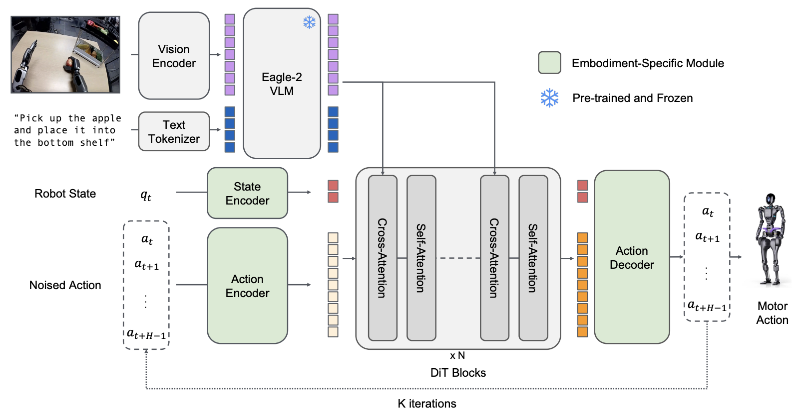

## Key Significance

- **First Open Humanoid Foundation Model**: First open VLA for humanoid robots with GR00T N1
- **Dual-System Architecture**: Inspired by human cognition - separates System 2 (VLM, planning/reasoning) and System 1 (Diffusion, real-time motion)
- **Demonstrates Power of Synthetic Data**: Generates 780K trajectories (6,500 hours) in just 11 hours via Omniverse, 40% performance improvement over real data only
- **NVIDIA Ecosystem Integration**: Hardware-software vertical integration from Isaac Sim/Lab, Omniverse, to Jetson Thor
- **Common Platform for Entire Industry**: Collaboration with major humanoid companies including Figure AI, Boston Dynamics, Unitree
- **Jetson Thor Dedicated Hardware**: 800 TFLOPS Blackwell-based robotics computing platform announced
- **Representative Case of Simulation-Based Scaling**: Presents possibility of large-scale training without real data collection
- **Continuous Improvement (N1.5/N1.6)**: Language instruction compliance 46.6%→93.3% (N1.5), 2x DiT and Cosmos VLM introduction (N1.6)

<em>GR00T N1 Architecture: System 2 (VLM) + System 1 (Diffusion Transformer) Dual-System Structure</em>

<em>GR00T N1.6: Various Manipulation Task Demonstration</em>

---

## Overview

GR00T (Generalist Robot 00 Technology) is a general-purpose humanoid robot foundation model announced by NVIDIA at GTC 2024 and open-sourced with the N1 series in 2025.

| Item | Details |
|------|---------|
| First Announced | March 18, 2024 (GTC 2024) |
| N1 Released | March 2025 (GTC 2025) |
| Company | NVIDIA |
| Paper | [arXiv:2503.14734](https://arxiv.org/abs/2503.14734) |
| GitHub | [NVIDIA/Isaac-GR00T](https://github.com/NVIDIA/Isaac-GR00T) |
| License | Apache 2.0 (Open Source) |

---

## Versions

### Project GR00T (2024.03)

First announced at GTC 2024. Presented vision for foundation model for humanoid robots.
- Announced goals: natural language understanding, human motion imitation, simulation-based learning
- Jetson Thor computing platform announced simultaneously

### GR00T N1 (2025.03)

World's first **open humanoid robot foundation model**.

| Item | Details |
|------|---------|
| Type | Vision-Language-Action (VLA) |
| Architecture | Dual-system architecture |
| Action Generation | Diffusion Transformer |
| VLM | Eagle2-1B |
| DiT | 16 layers |
| Training | 1K H100 GPUs, 250K steps |

### GR00T N1.5 (2025.05)

Significantly improved language instruction compliance.

| Item | Details |
|------|---------|
| Key Improvement | **Frozen VLM** (VLM fixed during training) |
| Loss Function | **FLARE Loss** (Flow-based Action Reconstruction) |
| Language Compliance | 46.6% → **93.3%** (+100%) |
| VLM | Eagle2-1B (Frozen) |
| DiT | 16 layers |

**Major Improvements:**
- Preserves language understanding by freezing VLM
- Optimizes balance between action prediction and language compliance with FLARE loss
- More than 2x improvement in language instruction compliance

### GR00T N1.6 (2025.06)

Model scale expansion and real-world performance improvement.

| Item | Details |
|------|---------|
| Key Improvement | **2x larger DiT**, **Cosmos VLM** |
| VLM | **Cosmos-2B** (2x compared to Eagle2-1B) |
| DiT | **32 layers** (2x compared to 16) |
| Action Space | **Relative Action Space** |
| Real World | Improved sim-to-real transfer performance |

**Major Improvements:**
- Diffusion Transformer expanded to 32 layers (2x)
- Enhanced visual understanding with Cosmos-2B VLM
- Improved generalization with Relative Action Space
- Better sim-to-real transfer performance

### Version Comparison

| Item | N1 | N1.5 | N1.6 |
|------|-----|------|------|
| VLM | Eagle2-1B | Eagle2-1B (Frozen) | Cosmos-2B |
| DiT Layers | 16 | 16 | **32** |
| Language Compliance | 46.6% | **93.3%** | 93%+ |
| Action Space | Absolute | Absolute | **Relative** |
| Key Contribution | First open model | Language compliance improvement | Scale expansion |

---

## Architecture

GR00T N1 is a **Dual-System architecture** inspired by human cognitive principles.

### System 2 (Slow Thinking)
- Based on Vision-Language Model
- Develops action plans by understanding environment and instructions
- Careful and methodical decision-making

### System 1 (Fast Thinking)
- Based on Diffusion Transformer
- Converts plans into precise continuous motions
- Corresponds to human reflexes/intuition

---

## Training

### Data Sources

| Source | Description |
|--------|-------------|
| Human Demonstration Data | Actual human actions (teleoperation) |
| Synthetic Data | Generated by NVIDIA Omniverse/Isaac Sim |
| Human Video | For motion pretraining |

<em>GR00T Training Data Distribution: Combination of real and synthetic data</em>

### Power of Synthetic Data

Efficiency of synthetic data generation through Omniverse:

| Item | Value |
|------|-------|
| Generated Synthetic Trajectories | 780,000 |
| Real-time Equivalent | 6,500 hours (9 months continuous) |
| Generation Time | **11 hours** |
| Performance Improvement | **+40%** over real data only |

### Training Infrastructure

| Item | Details |
|------|---------|
| GPU | 1,000x H100 |
| Training Steps | 250K steps |
| Framework | Isaac Lab + Omniverse |

---

## Capabilities

### Performable Tasks

- Object grasping
- Moving objects with single/bimanual
- Object transfer between arms
- Multi-step tasks requiring long context
- Combination of general skills

### Key Features

| Feature | Description |
|---------|-------------|
| Natural Language Understanding | Understands and executes language instructions |
| Motion Imitation | Learns by observing human behavior |
| Generalization | Easily generalizes to common tasks |

---

## Hardware: Jetson Thor

New computing platform designed for GR00T execution.

| Item | Spec |
|------|------|
| GPU Architecture | NVIDIA Blackwell |
| AI Performance | 800 TFLOPS (8-bit FP) |
| Transformer Engine | Built-in |
| Design | Modular, optimized for performance/power/size |

---

## Ecosystem: Isaac Platform

GR00T is part of NVIDIA's Isaac robotics platform.

| Component | Role |
|-----------|------|
| Isaac Sim | Simulation environment |
| Isaac Lab | Reinforcement learning framework |
| Omniverse | Synthetic data generation |
| GR00T | Foundation model |

---

## Industry Partners

NVIDIA is collaborating with major humanoid robot companies:

- 1X Technologies
- Agility Robotics
- Apptronik
- Boston Dynamics
- Figure AI
- Fourier Intelligence
- Sanctuary AI
- Unitree Robotics
- XPENG Robotics

---

## Cross-Embodiment

GR00T is designed to support various robot forms:

| Supported Robot | Type |
|-----------------|------|
| Fourier GR-1 | Humanoid |
| Unitree G1/H1 | Humanoid |
| Agility Digit | Humanoid |
| ALOHA | Bimanual manipulator |
| Franka | Single arm |

---

## Benchmarks

### LIBERO Benchmark (Simulation)

| Task | N1 Success Rate |
|------|-----------------|
| LIBERO-Object | 96.7% |
| LIBERO-Spatial | 92.5% |
| LIBERO-Goal | 85.0% |
| LIBERO-Long | 78.3% |

### Language Instruction Compliance (Language Following)

| Version | Compliance Rate |
|---------|-----------------|
| N1 | 46.6% |
| N1.5 | **93.3%** |
| N1.6 | 93%+ |

---

## Impact

Significance of GR00T series:

**N1 (2025.03)**
- **First open humanoid foundation model**
- Proved utilization of **large-scale synthetic data** through simulation
- **Separated planning and execution** with Dual-system architecture

**N1.5 (2025.05)**
- Solved **language understanding preservation** problem by freezing VLM
- Achieved **balance between action learning and language compliance** with FLARE loss

**N1.6 (2025.06)**
- **Improved expressiveness** through model scale expansion
- **Enhanced generalization ability** with Relative action space
- Provides **common platform** for entire humanoid industry

---

## References

### GR00T N1
- [NVIDIA Newsroom - GR00T N1](https://nvidianews.nvidia.com/news/nvidia-isaac-gr00t-n1-open-humanoid-robot-foundation-model-simulation-frameworks)
- [arXiv Paper - GR00T N1](https://arxiv.org/abs/2503.14734)

### GR00T N1.5
- [NVIDIA Research - GR00T N1.5](https://research.nvidia.com/labs/gear/gr00t-n1_5/)

### GR00T N1.6
- [NVIDIA Research - GR00T N1.6](https://research.nvidia.com/labs/gear/gr00t-n1_6/)

### Project GR00T
- [NVIDIA Newsroom - Project GR00T](https://nvidianews.nvidia.com/news/foundation-model-isaac-robotics-platform)
- [NVIDIA Developer - Isaac GR00T](https://developer.nvidia.com/isaac/gr00t)
- [GitHub - Isaac-GR00T](https://github.com/NVIDIA/Isaac-GR00T)
- [IEEE Spectrum Article](https://spectrum.ieee.org/nvidia-gr00t-ros)

---

## See Also

- [Model List](index)
- [NVIDIA](../companies/nvidia)
- [Simulation & World Model](../solutions/simulation-world-model)

### Related People
- [Jim Fan](../people/jim-fan) - NVIDIA GEAR Lab, GR00T Research Lead
