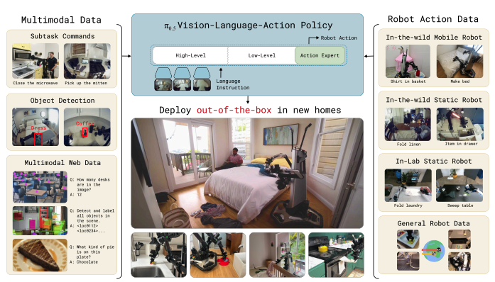

<div class="author-note">

### Author's Note

- **Turning Point from Lab to Real World**. Operating in completely new homes without training data is a significant milestone in robot generalization research. While existing VLAs stayed at lab level, Pi0.5 demonstrates real deployment potential.
- **Key Evidence for Web Data Utilization**. Demonstrates that transferring VLM's internet-scale knowledge to robots is crucial for generalization. Web data had the largest effect on OOD object recognition.
- **~100 Environment Scaling Law**. Provides practical guidelines for data collection. The finding that ~100 environments is sufficient (not infinitely many) is industrially significant.

</div>

## Key Significance

- **Open-World Generalization**: Works in completely new homes never seen during training - new standard for robot generalization
- **Web Data Co-training**: Simultaneous training with web data (image captioning, Visual QA, object detection) and robot data
- **Dual-Pathway Inference**: Same model generates both high-level semantic actions and low-level motor commands
- **Real Home Validation**: Performed kitchen/bedroom cleanup tasks in 3 San Francisco rental homes
- **Scaling Law Discovery**: Performance saturates after ~100 training environments - practical data requirements identified


<p align="center"><em>Pi0.5: Co-training Architecture for Open-World Generalization</em></p>

---

## Overview

Pi0.5 is an open-world generalization VLA announced by Physical Intelligence in April 2025. It overcomes the limitation of existing VLAs only working in environments similar to training, showing meaningful performance even in completely new environments.

| Item | Details |
|------|---------|
| Published | April 22, 2025 |
| Company | Physical Intelligence |
| Paper | [arXiv:2504.16054](https://arxiv.org/abs/2504.16054) |
| Blog | [pi.website/blog/pi05](https://www.pi.website/blog/pi05) |
| Base | Pi0 |

---

## Key Innovation: Open-World Generalization

### Limitations of Existing VLAs

| Existing VLA | Pi0.5 |
|--------------|-------|
| Only works in environments similar to training | **Works in completely new environments** |
| Lab level | **Real home level** |
| Specialized for specific objects | **Handles previously unseen objects** |

### Validation

- **Location**: 3 San Francisco rental homes
- **Condition**: Completely new environments not in training data
- **Tasks**: Kitchen cleanup, bedroom cleanup, dish washing, etc.

---

## Architecture

### Co-training Strategy

Pi0.5 trains on various data sources simultaneously. 97.6% of the total training data comes from sources other than mobile manipulators.

### Role by Data Type

| Data Type | Role |
|-----------|------|
| **Web Data** | Image captioning, Visual QA, Object detection -> Visual understanding |
| **Language Demonstrations** | Step-by-step instruction learning -> Following language instructions |
| **Subtask Commands** | High-level semantic labels -> Hierarchical understanding |
| **Robot Actions** | Multi-embodiment -> Physical control |

---

## Dual-Pathway Inference


<p align="center"><em>Pi0.5 Dual-Pathway Inference</em></p>

Pi0.5 generates two levels of output from the same model **sequentially**.

### Inference Order

1. **High-Level**: VLM first generates subtask text tokens autoregressively
2. **Low-Level**: Action Expert generates continuous actions via flow matching, conditioned on the generated subtask

> Important: Low-level action is conditioned on the **predicted subtask (ℓ̂)**, not the original instruction (ℓ)

### Training Approach

| Phase | Method |
|-------|--------|
| Pre-training | FAST tokenization for discrete action learning (efficient next-token prediction) |
| Post-training | Add Action Expert for continuous action generation (flow matching) |

### Chain-of-Thought Effect

```
"Clean up the bedroom"
    ↓
"Pick up pillow" (discrete) → [motor commands] (continuous)
    ↓
"Spread blanket" (discrete) → [motor commands] (continuous)
    ↓
...
```

---

## Training Data Ablation

### Effect by Data Type

| Data | Effect |
|------|--------|
| **Web Data** | Largest effect on OOD object recognition |
| **Cross-Embodiment (CE)** | ~17-18% performance improvement |
| **Multiple Environment (ME)** | ~33-66% performance improvement |

### Scaling Study

| Number of Training Environments | Performance |
|--------------------------------|-------------|
| 10 | Baseline |
| 50 | Significant improvement |
| **~100** | **Performance saturation** |

**Insight**: After ~100 environments, similar performance to training directly in test environment

---

## Performance

### Open-World Tasks

| Environment | Task | Performance |
|-------------|------|-------------|
| New Kitchen | Putting in dishwasher | Capable |
| New Bedroom | Bed making | Capable |
| New Living Room | Object organization | Capable |

### Characteristics

- **Reactive Policy**: Responds to environmental changes and human interference
- **Language Flexibility**: "Dish in sink" ~ "Clear the dishes"
- **Object Generalization**: Category-level understanding of previously unseen objects

### Limitations

| Limitation | Description |
|------------|-------------|
| **Hardware Generalization** | Difficulties with unfamiliar drawer handles, cabinet physics |
| **Partial Observability** | Arm occludes view during cleaning tasks |
| **High-Level Distraction** | High-level inference easily becomes distracted |
| **Prompt Complexity** | Limited prompts supported based on training annotations |
| **Context Window** | Narrow context limits navigation across rooms |
| **Multiple Attempts** | Requires multiple attempts on unfamiliar tasks |

---

## Comparison with Pi0

| Item | Pi0 | Pi0.5 |
|------|-----|-------|
| Generalization | Within training environment | **New environments** |
| Training Data | Mainly robot data | **Web + Robot** |
| Mock Home Performance | ~35% | **~65%** |
| High-Level Reasoning | None | **Dual-Pathway** |

---

## Real-World Testing

### Test Environment

- **Location**: San Francisco
- **Type**: 3 rental homes
- **Condition**: Not in training data at all

### Performed Tasks

| Task | Complexity |
|------|------------|
| Kitchen Cleanup | Multi-object, multi-location |
| Bedroom Cleanup | Bed making, pillow arrangement |
| Dish Washing | Sink -> Dishwasher |

### Observations

> "Shows hints of the flexibility and resourcefulness with which a person approaches new challenges"

- Not perfect but meaningful progress
- Level impossible with existing VLAs

---

## Technical Details

### Model Specifications

| Component | Spec |
|-----------|------|
| VLM Backbone | 3B |
| Action Expert | 300M |
| Total Parameters | ~3.3B |
| Control Frequency | 50Hz |

### Training

| Item | Details |
|------|---------|
| Base | Pi0 checkpoint |
| Pre-training | 280k gradient steps |
| Post-training | 80k gradient steps |
| Additional | Web data, Verbal Instruction co-training |

---

## Related Research: Knowledge Insulation

A separate research contribution that can be applied on top of Pi0.5.

### Concept

Knowledge Insulation (KI) is a training technique that prevents the knowledge embedded in VLM backbone from being corrupted during robot training.

### How It Works

| Problem | Solution |
|---------|----------|
| Action Expert -> VLM backpropagation | **Gradient Blocking** |
| Robot training damaging language understanding | **Representation learning with FAST discretized actions** |

### Results (Pi0.5 + KI)

- **7.5x fewer training steps** compared to Pi0
- Improved language instruction compliance
- Preserved visual understanding ability

> Details: [Knowledge Insulation Research](https://www.pi.website/research/knowledge_insulation)

---

## References

- [arXiv Paper](https://arxiv.org/abs/2504.16054)
- [Physical Intelligence Blog - Pi0.5](https://www.pi.website/blog/pi05)
- [Knowledge Insulation Research](https://www.pi.website/research/knowledge_insulation)

---

## See Also

- [Pi Series](pi-series)
- [Pi0](pi0)
- [Pi*0.6](pi0-6-star)
- [Physical Intelligence](../companies/physical-intelligence)

### Related People
- [Karol Hausman](../people/karol-hausman) - Physical Intelligence Co-founder
- [Chelsea Finn](../people/chelsea-finn) - Physical Intelligence Co-founder
- [Sergey Levine](../people/sergey-levine) - Physical Intelligence Co-founder
- [Pete Florence](../people/pete-florence) - Physical Intelligence Co-founder
