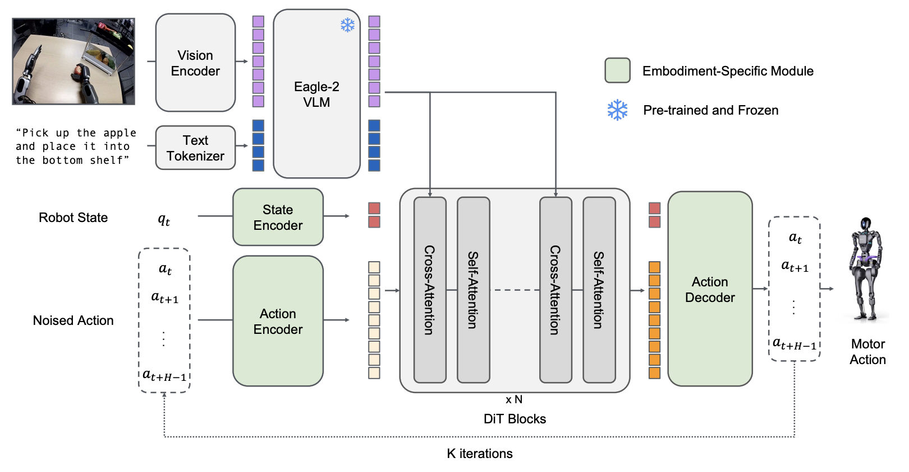

### 필자의 의견

- GR00T 시리즈의 VLM으로 사용됨. 태스크마다 필요한 시각적 이해 능력이 다르므로, 여러 Vision Encoder를 병렬로 사용하여 해결.
- 복잡한 fusion 없이 단순 concatenation만으로도 LLM이 필요한 정보를 선택적으로 활용한다는 점이 흥미로움.

## 핵심 의의

- **Mixture of Encoders**: 다양한 Vision Encoder를 병렬로 사용하여 상호보완적 시각 이해 달성
- **데이터 중심 접근법**: 아키텍처보다 **포스트 트레이닝 데이터 전략**에 집중
- **GR00T 시리즈의 시각적 두뇌**: N1에서 Eagle2-1B, N1.5에서 Eagle 2.5를 VLM으로 채택
- **효율적 성능**: Eagle2-9B가 70B급 모델과 동등한 성능 달성

---

## Overview

Eagle은 NVIDIA가 개발한 프론티어 비전-언어 모델(VLM) 시리즈입니다. **"데이터 중심(Data-Centric)"** 철학을 바탕으로 포스트 트레이닝 데이터 전략, 비전 중심 모델 설계, 확장 가능한 학습 기법을 결합하여 경쟁력 있는 파라미터 효율성으로 프론티어급 성능을 달성합니다.

| 항목 | 내용 |
|------|------|
| 개발사 | NVIDIA |
| 최초 발표 | 2024년 8월 (Eagle v1) |
| 라이선스 | 코드: Apache 2.0, 모델: CC-BY-NC-4.0 |
| GitHub | [NVlabs/EAGLE](https://github.com/NVlabs/EAGLE) |
| 데모 | [HuggingFace Demo](https://huggingface.co/spaces/nvidia/Eagle2-Demo) |

---

## Versions

### Eagle (v1) - 2024.08

멀티모달 LLM을 위한 **Mixture of Encoders** 설계 공간 탐색. ICLR 2025 Spotlight 선정.

| 항목 | 내용 |
|------|------|
| 발표 | 2024년 8월 28일 |
| 논문 | [arXiv:2408.15998](https://arxiv.org/abs/2408.15998) |
| 핵심 기여 | Mixture of Encoders 설계, Pre-Alignment 기법 |
| 수상 | ICLR 2025 Spotlight |

**주요 발견:**
- 상호 보완적인 비전 인코더의 시각적 토큰을 **단순 연결(concatenation)**하는 것이 복잡한 믹싱 아키텍처만큼 효과적
- **Pre-Alignment** 도입으로 비전 인코더와 언어 토큰 간 일관성 향상
- 향상된 시각적 인식이 환각(hallucination) 감소 및 OCR 성능 개선에 기여

---

### Eagle 2 시리즈 - 2025.01

**포스트 트레이닝 데이터 전략**을 처음부터 구축하는 방법론 공개.

| 항목 | 내용 |
|------|------|
| 발표 | 2025년 1월 20일 |
| 논문 | [arXiv:2501.14818](https://arxiv.org/abs/2501.14818) |
| 핵심 기여 | 데이터 중심 전략, Tiled Mixture of Encoders |

#### Eagle2 모델 라인업

| 모델 | LLM 백본 | Vision Encoder | 파라미터 | 컨텍스트 |
|------|----------|----------------|----------|----------|
| **Eagle2-1B** | Qwen2.5-0.5B-Instruct | SigLIP | 1B | 16K |
| **Eagle2-2B** | Qwen2.5-1.5B-Instruct | SigLIP | 2B | 16K |
| **Eagle2-9B** | Qwen2.5-7B-Instruct | SigLIP + ConvNeXt | 8.9B | 16K |

#### Eagle2 벤치마크 성능

**Eagle2-9B vs 경쟁 모델:**

| 벤치마크 | Eagle2-9B | Qwen2-VL-7B | GPT-4V |
|----------|-----------|-------------|--------|
| DocVQA | 92.6% | 94.5% | 88.4% |
| ChartQA | **86.4%** | 83.0% | - |
| OCRBench | **868** | 845 | - |
| MMMU | **56.1%** | 54.1% | - |
| MathVista | **63.8%** | 58.2% | - |
| MMStar | **62.6%** | 60.7% | - |

**Eagle2-1B 벤치마크:**

| 벤치마크 | Eagle2-1B |
|----------|-----------|
| DocVQA | 81.8% |
| ChartQA | 77.0% |
| TextVQA | 76.6% |
| OCRBench | 767 |
| AI2D | 70.9% |

**Eagle2-2B vs InternVL2-2B:**

| 벤치마크 | Eagle2-2B | InternVL2-2B |
|----------|-----------|--------------|
| TextVQA | **79.1%** | 73.4% |
| OCRBench | **818** | 784 |
| MME | **2109.8** | 1876.8 |
| MMStar | **56.4%** | 50.1% |

---

### Eagle 2.5 - 2025.04

**Long-Context 멀티모달 학습**을 위한 프론티어 VLM.

| 항목 | 내용 |
|------|------|
| 발표 | 2025년 4월 21일 |
| 논문 | [arXiv:2504.15271](https://arxiv.org/abs/2504.15271) |
| 핵심 기여 | 512 프레임 비디오 지원, Eagle-Video-110K 데이터셋 |

#### Eagle 2.5 모델

| 모델 | LLM 백본 | Vision Encoder | 파라미터 | 비디오 프레임 |
|------|----------|----------------|----------|---------------|
| **Eagle2.5-8B** | Qwen2.5-7B-Instruct | SigLIP2-So400m | 8B | 최대 512 |

#### 핵심 기술 혁신

| 기술 | 설명 |
|------|------|
| **Image Area Preservation (IAP)** | 원본 이미지 면적과 종횡비 최대 보존을 위한 타일링 최적화 |
| **Automatic Degrade Sampling (ADS)** | 시각/텍스트 입력의 동적 균형 조절, 텍스트 완전성 보장 |
| **Progressive Training** | 32K → 128K로 컨텍스트 길이 점진적 확장 |
| **Eagle-Video-110K** | 스토리/클립 수준 어노테이션 포함 110K 비디오 데이터셋 |

#### Eagle 2.5 벤치마크

**비디오 이해 벤치마크:**

| 벤치마크 | Eagle2.5-8B | GPT-4o | Qwen2.5-VL-72B |
|----------|-------------|--------|----------------|
| Video-MME (w/o sub) | **72.4%** | 71.9% | - |
| Video-MME (w/ sub) | **75.7%** | 77.2% | - |
| MLVU | **77.6%** | - | - |
| LVBench | **66.4%** | 66.7% | - |
| EgoSchema | **72.2%** | - | 72.2% |

**이미지 벤치마크:**

| 벤치마크 | Eagle2.5-8B | GPT-4o |
|----------|-------------|--------|
| DocVQA | **94.1%** | 92.8% |
| OCRBench | **869** | 736 |
| TextVQA | **83.7%** | 77.4% |

---

## Architecture

### Mixture of Encoders

Eagle의 핵심 아키텍처는 **여러 Vision Encoder를 병렬로 사용**하는 것입니다.

핵심 발견: **"상호보완적인 비전 인코더들의 시각적 토큰을 단순 연결(concatenation)하는 것이 복잡한 믹싱 아키텍처만큼 효과적"**

#### 병렬 인코딩 구조 (Eagle2-9B)

SigLIP과 ConvNeXt는 **직렬이 아닌 병렬**로 동작합니다. 같은 이미지가 두 인코더에 각각 입력되어 독립적으로 처리된 후 Channel Concatenation으로 결합됩니다.

| Encoder | 역할 | 강점 |
|---------|------|------|
| **SigLIP** | 글로벌 의미적 이해 | Vision-Language 정렬, 일반적 시각 인식 |
| **ConvNeXt** | 로컬 세부 특성 | OCR, 차트/문서 이해, 고해상도 디테일 |

두 관점이 독립적으로 이미지를 해석하고, LLM이 concat된 특성에서 필요한 정보를 선택적으로 활용합니다.

### 구성 요소

| 구성 요소 | 역할 |
|-----------|------|
| **SigLIP** | Vision-Language 정렬 비전 인코더. 글로벌 의미 이해 |
| **ConvNeXt-XXLarge** | LAION-2B로 학습된 CNN. 로컬 피처 추출 (Eagle2-9B만) |
| **MLP Projector** | 비전 임베딩과 LLM 표현 공간 정렬 |
| **Qwen2.5** | LLM 백본 (0.5B/1.5B/7B 버전별 선택) |

---

## GR00T와의 연계

Eagle VLM은 NVIDIA GR00T 로봇 파운데이션 모델의 **System 2 (The Thinker)** 역할을 담당합니다.

### GR00T N1 (2025.03)

| 항목 | 내용 |
|------|------|
| VLM | **Eagle2-1B** (학습 가능) |
| 총 파라미터 | 2.2B (VLM: 1.34B) |
| 역할 | 환경 인식 및 언어 지시 이해 |
| 학습 방식 | VLM이 전체 모델과 함께 파인튜닝됨 |

### GR00T N1.5 (2025.05)

| 항목 | 내용 |
|------|------|
| VLM | **Eagle 2.5** (Frozen) |
| 핵심 변경 | VLM을 **고정(Frozen)**하여 언어 이해 능력 보존 |
| 결과 | 언어 지시 준수율 46.6% → **93.3%** |
| Grounding | 40.4 IoU (Qwen2.5VL: 35.5) |

### System 1, 2 구조에서의 역할

<em>GR00T N1 아키텍처: Eagle VLM이 System 2 역할 담당</em>

- **System 2 (Eagle)**: 환경 인식, 언어 지시 이해, 행동 계획
- **System 1 (Diffusion)**: 연속 동작 생성, 실시간 제어

---

## 버전별 비교 요약

| 항목 | Eagle (v1) | Eagle 2 | Eagle 2.5 |
|------|------------|---------|-----------|
| 발표 | 2024.08 | 2025.01 | 2025.04 |
| 논문 | arXiv:2408.15998 | arXiv:2501.14818 | arXiv:2504.15271 |
| LLM | - | Qwen2.5 (0.5B~7B) | Qwen2.5-7B |
| Vision | Mixture of Encoders 탐색 | SigLIP (+ConvNeXt) | SigLIP2 |
| 핵심 기여 | 아키텍처 설계 | 데이터 전략 | Long-Context |
| 비디오 | - | 64 프레임 | **512 프레임** |
| GR00T 적용 | - | N1 (Eagle2-1B) | N1.5 |

---

## 학습 인프라

| 항목 | Eagle2-9B |
|------|-----------|
| GPU | 256× H100 |
| 학습 시간 | 수십 시간 |
| 정밀도 | BF16 |

---

## References

### 논문
- [Eagle: Exploring The Design Space for Multimodal LLMs with Mixture of Encoders](https://arxiv.org/abs/2408.15998) (2024.08)
- [Eagle 2: Building Post-Training Data Strategies from Scratch for Frontier Vision-Language Models](https://arxiv.org/abs/2501.14818) (2025.01)
- [Eagle 2.5: Boosting Long-Context Post-Training for Frontier Vision-Language Models](https://arxiv.org/abs/2504.15271) (2025.04)

### 모델
- [nvidia/Eagle2-1B](https://huggingface.co/nvidia/Eagle2-1B)
- [nvidia/Eagle2-2B](https://huggingface.co/nvidia/Eagle2-2B)
- [nvidia/Eagle2-9B](https://huggingface.co/nvidia/Eagle2-9B)
- [nvidia/Eagle2.5-8B](https://huggingface.co/nvidia/Eagle2.5-8B)

### 코드
- [GitHub - NVlabs/EAGLE](https://github.com/NVlabs/EAGLE)

---

## See Also

- [모델 목록](./)
- [GR00T](groot) - Eagle을 VLM으로 사용하는 휴머노이드 로봇 파운데이션 모델
- [NVIDIA](../companies/nvidia)

### 관련 기술
- [SigLIP](https://arxiv.org/abs/2303.15343) - Google의 Vision-Language 인코더
- [Qwen2.5](https://arxiv.org/abs/2412.15115) - Alibaba의 LLM 시리즈
- [ConvNeXt](https://arxiv.org/abs/2201.03545) - Meta의 현대화된 CNN 아키텍처
- [OpenCLIP](https://github.com/mlfoundations/open_clip) - ConvNeXt-XXLarge 학습에 사용된 프레임워크
- [LAION-2B](https://arxiv.org/abs/2210.08402) - ConvNeXt-XXLarge 학습에 사용된 대규모 이미지-텍스트 데이터셋
