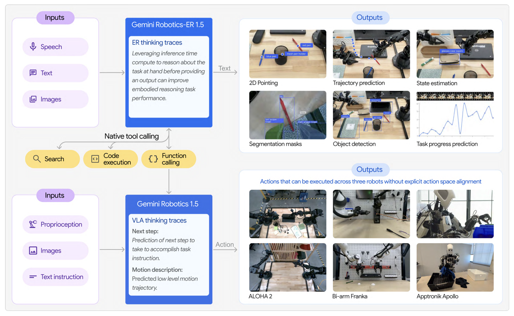

# Gemini Robotics

> Home > Models > Gemini Robotics

---

## 핵심 의의

- **대형 LLM 기반 VLA의 정점**: Gemini 2.0을 기반으로 하여 인터넷 스케일 지식을 로보틱스에 적용한 대표적 사례
- **Cross-Embodiment 지원**: 단일 모델로 양팔 고정형(ALOHA, Franka)부터 휴머노이드(Apptronik Apollo)까지 다양한 로봇 형태 지원
- **System 1/2 구조**: Gemini Robotics 1.5에서 "행동 전 사고(Think before action)" - 고수준 추론/판단은 클라우드, 실시간 액션 생성은 On-Device에서 수행
- **On-Device 버전**: 네트워크 독립적인 저지연 추론으로 실제 배포 환경 고려
- **CoRL 2025 현장 데모**: 학회에서 일반 참가자들이 직접 체험할 수 있는 부스를 운영하며 실제 동작 공개
- **RT 시리즈 대비 데이터 확대**: 학습 데이터 규모가 RT-1/2보다 크게 확대되었으나 구체적 수치는 비공개
- **산업 파트너십**: Boston Dynamics, Agility Robotics 등 주요 휴머노이드 회사들이 신뢰 테스터로 참여

<em>Gemini Robotics: Gemini 2.0 기반 VLA 모델 패밀리</em>

---

## Overview

Gemini Robotics는 Google DeepMind가 2025년 3월 발표한 Gemini 2.0 기반 로보틱스 모델 시리즈입니다. 물리적 행동을 새로운 출력 모달리티로 추가하여 로봇을 직접 제어할 수 있습니다.

| 항목 | 내용 |
|------|------|
| 발표 | 2025년 3월 12일 |
| 기반 | Gemini 2.0 |
| 논문 | [arXiv:2503.20020](https://arxiv.org/abs/2503.20020) |
| 공식 | [deepmind.google/models/gemini-robotics](https://deepmind.google/models/gemini-robotics/) |

---

## Model Family

### Gemini Robotics (기본)

Gemini 2.0에 물리적 액션 출력을 추가한 VLA 모델.

### Gemini Robotics-ER

**Embodied Reasoning** 능력을 갖춘 버전.
- 고급 공간 이해
- 로보틱스 프로그램 실행 지원

### Gemini Robotics On-Device (2025.06)

로봇 기기에서 로컬 실행되는 가장 강력한 VLA 모델.

| 특징 | 설명 |
|------|------|
| 로컬 실행 | 네트워크 독립 |
| 저지연 | 지연 민감 응용에 적합 |
| 강건성 | 간헐적/제로 연결 환경 |

### Gemini Robotics 1.5

가장 고성능 버전.
- 시각 정보 → 모터 명령 변환
- "행동 전 사고" (Think before action)
- 작업 과정 투명하게 표시

---

## Core Capabilities

로보틱스 AI에 필요한 3가지 핵심 특성:

| 특성 | 설명 |
|------|------|
| **General** | 다양한 상황에 적응 |
| **Interactive** | 지시/환경 변화에 빠르게 반응 |
| **Dexterous** | 손가락으로 하는 섬세한 작업 수행 |

---

## Performance

**일반화 벤치마크에서 SOTA VLA 대비 2배 이상 성능**

### 수행 가능 태스크

- 종이접기 (origami)
- 도시락 싸기 (packing lunch box)
- 샐러드 준비 (preparing salad)
- 기타 정밀 조작 태스크

---

## Robot Compatibility

단일 모델로 다양한 로봇 형태 지원:

| 로봇 타입 | 예시 |
|----------|------|
| 양팔 고정형 | ALOHA, Bi-arm Franka |
| 휴머노이드 | Apptronik Apollo |

---

## Industry Partners

### 신뢰 테스터 (Gemini Robotics-ER)
- Agile Robots
- Agility Robots
- Boston Dynamics
- Enchanted Tools

### 전략적 파트너
- **Apptronik**: Gemini 2.0으로 차세대 휴머노이드 개발

---

## Relationship with RT Series

| 모델 | 시기 | 특징 |
|------|------|------|
| RT-1 | 2022 | 첫 Robotics Transformer |
| RT-2 | 2023 | 첫 VLA (PaLM-E 기반) |
| RT-X | 2023 | 멀티 로봇 |
| Gemini Robotics | 2025 | Gemini 2.0 기반, 가장 강력 |

---

## References

- [Google DeepMind - Gemini Robotics](https://deepmind.google/models/gemini-robotics/)
- [Blog - Gemini Robotics](https://deepmind.google/blog/gemini-robotics-brings-ai-into-the-physical-world/)
- [Blog - On-Device](https://deepmind.google/discover/blog/gemini-robotics-on-device-brings-ai-to-local-robotic-devices/)
- [arXiv Paper](https://arxiv.org/abs/2503.20020)
- [How Google Built Gemini Robotics](https://blog.google/products/gemini/how-we-built-gemini-robotics/)

---

## See Also

- [모델 목록](index.md)
- [RT](rt.md)
- [Google DeepMind](../companies/google-deepmind.md)

