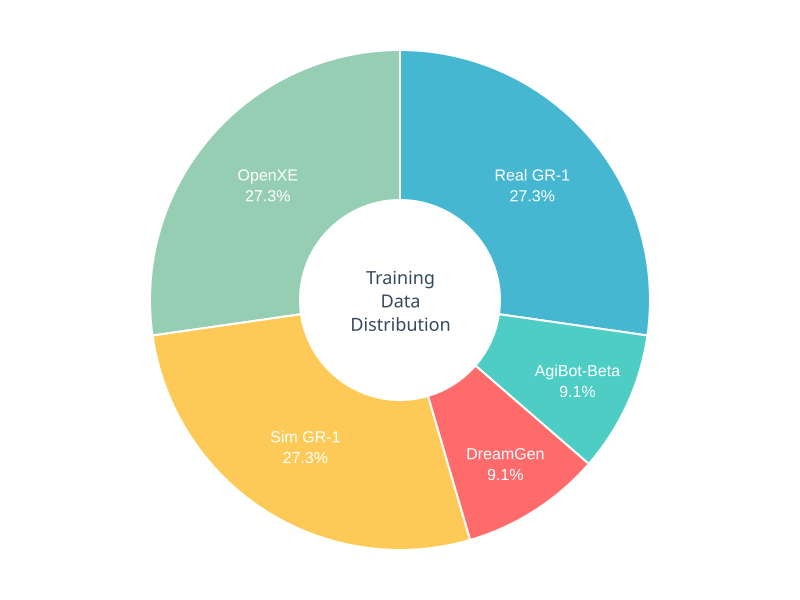

<div class="author-note">

### 필자의 의견

- 범용 RFM(Robot Foundation Model)을 향해 **언어 지시 준수 능력 개선에 집중**한 버전. Frozen VLM으로 언어 이해력을 보존하면서 로봇 제어와 결합, 준수율 2배 향상(46.6% → 93.3%).
- **Human video에서 학습 가능**함을 보여줌. FLARE 덕분에 액션 레이블 없는 인간 비디오로도 학습 가능. 비싼 teleop 데이터 의존도를 낮출 수 있는 방향.
- **합성 데이터의 위력은 여전**. DreamGen이 9.1%뿐인데도 22개 새로운 동사(verb) 학습. pick-and-place 넘어서는 행동 다양성 확장의 핵심.

</div>

## 핵심 의의

- **언어 지시 준수율 2배 향상**: 46.6% → 93.3% (+46.7%p)
- **Frozen VLM 기법**: VLM을 고정하여 언어 이해 능력 보존
- **FLARE Loss 도입**: 암시적 세계 모델링을 통한 학습 목표 추가
- **Human Video 학습 능력 부여**: FLARE를 통해 post-training에서 인간 비디오 학습 가능
- **새로운 물체 조작**: Post-training 후 0-shot으로 새로운 물체 조작 가능 (15%)

> **중요**: HuggingFace에 공개된 GR00T-N1.5-3B는 **pretrained model**입니다. Human video 학습, Unitree G1 실험 등은 FLARE가 부여하는 **능력(capability)**을 보여주는 post-training 실험 결과이며, 공개된 모델 가중치에 포함되지 않습니다.

---

## Overview

| 항목 | 내용 |
|------|------|
| 발표 | 2025년 5월 20일 (Computex 2025, 대만) |
| 타입 | Vision-Language-Action (VLA) |
| 파라미터 | 3B |
| VLM | [Eagle](eagle) 2.5 (Frozen) |
| DiT | 16 layers |
| 핵심 기술 | Frozen VLM + FLARE Loss |
| GitHub | [NVIDIA/Isaac-GR00T](https://github.com/NVIDIA/Isaac-GR00T) |
| Hugging Face | [nvidia/GR00T-N1.5-3B](https://huggingface.co/nvidia/GR00T-N1.5-3B) |

---

## N1 대비 주요 개선점

### 1. Frozen VLM (Vision-Language Model)

N1.5의 핵심 아키텍처 변경점입니다.

| 구분 | N1 | N1.5 |
|------|-----|------|
| VLM 학습 방식 | 학습 가능 (Trainable) | **동결 (Frozen)** |
| VLM 모델 | Eagle2-1B | **Eagle 2.5** |
| Grounding IoU | 35.5 | **40.4** (GR-1 기준) |

**주요 특징:**
- VLM이 사전학습(pretraining)과 미세조정(finetuning) **모두에서 동결** 상태 유지
- 언어 이해 능력 보존 및 일반화 성능 향상
- NVIDIA Eagle 2.5 기반으로 물리적 이해와 그라운딩 능력 강화
- 간소화된 어댑터 MLP + 시각/텍스트 토큰 임베딩에 Layer Normalization 추가

### 2. FLARE Loss (Future LAtent REpresentation Alignment)

N1.5에 새롭게 추가된 학습 목표(objective)입니다.

**개념:**
- 기존 N1의 Flow Matching Loss에 **FLARE Loss를 추가**
- 미래 프레임을 생성적으로 모델링하는 대신, **미래 상태의 잠재 표현(latent representation)과 정렬**하는 방식
- 정책 네트워크가 미래 잠재 상태를 내부적으로 추론하면서 액션 예측 능력 유지

**작동 방식:**
1. 표준 VLA 모델에 학습 가능한 "미래 토큰(future tokens)" 추가
2. 이 토큰들이 미래 로봇 관측 임베딩과 정렬되도록 학습
3. 코사인 유사도를 사용한 Future Latent Alignment Loss 계산
4. FLARE Loss 계수: **0.2** (사전학습 및 후처리 모두)

**핵심 이점:**
- **인간 에고센트릭(egocentric) 비디오에서 직접 학습 가능**
- 로봇 시연 데이터 없이 인간 비디오만으로도 의미 있는 학습
- 새로운 물체 조작 능력 대폭 향상

**관련 논문:** [FLARE: Robot Learning with Implicit World Modeling (arXiv:2505.15659)](https://arxiv.org/abs/2505.15659)

---

## Architecture

### 전체 아키텍처 구성

| 구성요소 | 설명 |
|---------|------|
| Vision Encoder | SigLip2 기반 Vision Transformer (224x224 RGB 입력) |
| Language Encoder | T5 기반 Transformer |
| Proprioception Encoder | Embodiment ID로 인덱싱된 MLP |
| Action Decoder | Flow Matching Transformer (DiT 기반) |
| 모델 크기 | **3B 파라미터** |
| 텐서 타입 | BF16 |

### N1 vs N1.5 아키텍처 비교

| 항목 | GR00T N1 | GR00T N1.5 |
|------|----------|------------|
| VLM 상태 | 학습 가능 | **동결 (Frozen)** |
| VLM 모델 | Eagle2-1B | **Eagle 2.5** |
| 어댑터 MLP | 복잡 | **간소화 + LayerNorm** |
| 학습 목표 | Flow Matching | **Flow Matching + FLARE** |
| 세계 모델링 | 없음 | **암시적 세계 모델링 통합** |
| 모델 파라미터 | 2.2B | **3B** |

---

## Benchmarks

### 언어 지시 준수율 (실제 GR-1 휴머노이드)

두 개의 과일 중 언어 명령으로 지정된 특정 과일을 집어 접시에 놓는 작업:

| 모델 | 언어 지시 준수율 |
|------|-----------------|
| GR00T N1 | 46.6% |
| **GR00T N1.5** | **93.3%** |

**개선폭: +46.7%p (약 2배 향상)**

### 시뮬레이션 벤치마크

| 벤치마크 | GR00T N1 | GR00T N1.5 | 개선폭 |
|----------|----------|------------|--------|
| Language Table (sim) | 52.8% | **93.2%** | +40.4%p |
| Sim GR-1 Language | 36.4% | **54.4%** | +18.0%p |
| RoboCasa (30 demos) | 17.4% | **47.5%** | +30.1%p |
| DreamGen Tasks (12개) | 13.1% | **38.3%** | +25.2%p |

### 실제 로봇 벤치마크 (GR-1 휴머노이드)

| 작업 | GR00T N1 | GR00T N1.5 |
|------|----------|------------|
| 언어 지시 준수율 | 46.6% | **93.3%** |
| 새로운 물체 조작 (0-shot) | 0% | **15.0%** |

### FLARE 단독 성능

100개 trajectory/작업 기준 실제 GR-1 조작 작업: **95.1% 평균 성공률**

### 인간 비디오 학습 효과

| 조건 | 성공률 |
|------|--------|
| 1-shot (로봇 시연만) | 37.5% |
| 1-shot + 인간 에고센트릭 비디오 | **60.0%** |
| 10-shot + 인간 에고센트릭 비디오 | **80.0%** |

---

## Training

### Pretraining (사전학습)

HuggingFace에 공개된 GR00T-N1.5-3B 모델의 사전학습 데이터 구성입니다.


<p align="center"><em>GR00T N1.5 사전학습 데이터 분포 (출처: <a href="https://research.nvidia.com/labs/gear/gr00t-n1_5/">NVIDIA Research</a>)</em></p>

#### 사전학습 데이터 구성

| 데이터 소스 | 비중 | 설명 |
|-------------|------|------|
| Real GR-1 | 27.3% | NVIDIA 내부 수집 실제 로봇 데이터 |
| OpenXE | 27.3% | Open X-Embodiment 오픈소스 데이터 |
| Sim GR-1 (DexMG) | 27.3% | 시뮬레이션 합성 데이터 |
| [DreamGen](dreamgen) | 9.1% | Neural trajectory 합성 데이터 |
| AgiBot-Beta | 9.1% | AgiBot 협력 데이터 |

> **참고**: 사전학습 데이터에는 **Human video 데이터가 포함되지 않습니다**. Human video 학습은 FLARE가 부여하는 **능력**이며, post-training에서 활용됩니다.

#### 학습 인프라

| 항목 | 내용 |
|------|------|
| GPU | 1,000× H100 |
| 학습 스텝 | 250K steps |
| 배치 크기 | 16,384 |
| 옵티마이저 | AdamW |
| 학습률 스케줄 | Cosine (warmup ratio 0.05) |
| FLARE Loss 계수 | 0.2 |

---

### FLARE (Future LAtent REpresentation Alignment)

N1.5에 추가된 핵심 학습 목표입니다. FLARE는 별도 논문([arXiv:2505.15659](https://arxiv.org/abs/2505.15659))으로 발표되었습니다.

#### 핵심 개념

FLARE는 미래 프레임을 픽셀 단위로 생성하는 대신, **미래 상태의 잠재 표현(latent representation)**과 정렬하는 경량화된 접근법입니다.

**Future Tokens 메커니즘:**
1. 표준 VLA 모델에 **학습 가능한 "미래 토큰(future tokens)" 임베딩**을 추가
2. Diffusion Transformer 내부 레이어 L에서 M개의 미래 토큰에 해당하는 중간 표현을 추출
3. MLP를 통해 프로젝션 후, **동결된 Vision-Language 임베딩**과 정렬

**전체 학습 목표:**
```
ℒ = ℒ_fm + λℒ_align (λ = 0.2)
```

#### FLARE의 장점

- **경량 구현**: 표준 VLA 모델에 몇 개의 토큰만 추가하는 최소한의 아키텍처 변경
- **추론 효율성**: 배포 시 미래 Vision-Language 임베딩 계산 불필요
- **Human video 학습 능력 부여**: Post-training에서 액션 레이블 없는 인간 비디오 활용 가능
- **최대 26% 성능 향상**: 멀티태스크 시뮬레이션 벤치마크에서 베이스라인 대비

---

### Post-training 실험 결과

다음은 FLARE가 부여하는 **능력을 검증**하기 위한 실험 결과입니다. 이 결과들은 공개된 pretrained model에 포함되지 않습니다.

#### Unitree G1 Post-training

1,000개의 teleoperation episode로 N1과 N1.5를 post-training한 결과:

| 지표 | GR00T N1 | GR00T N1.5 |
|------|----------|------------|
| 기존 과일 조작 성공률 | 44.0% | **98.8%** |
| 새로운 물체 5개 일반화 | - | **84.2%** |

#### Human Video Learning (FLARE 논문 실험)

FLARE의 핵심 기여는 **액션 레이블 없이 인간 에고센트릭 비디오에서 학습**할 수 있다는 점입니다.

**비대칭 손실 함수 적용:**
- 로봇 시연 데이터 (액션 포함): Flow Matching Loss + Future Alignment Loss
- 인간 비디오 (액션 없음): **Future Alignment Loss만 적용**

**데이터 수집:**
- 헤드 마운트 **GoPro 카메라**로 에고센트릭 시연 수집
- 물체당 약 **150개의 인간 에고센트릭 시연**

<div style="display: flex; gap: 1rem; margin: 1.5rem 0;">
  <video src="/assets/videos/groot/flare_ego.mp4" autoplay loop muted playsinline style="flex: 1; max-width: 50%; border-radius: 8px;"></video>
  <video src="/assets/videos/groot/flare_robot.mp4" autoplay loop muted playsinline style="flex: 1; max-width: 50%; border-radius: 8px;"></video>
</div>
<p align="center"><em>좌: GoPro로 촬영한 인간 에고센트릭 시연 / 우: GR-1 로봇 시연 (출처: <a href="https://research.nvidia.com/labs/gear/gr00t-n1_5/">NVIDIA Research</a>)</em></p>

**실험 결과** (새로운 형상의 5개 물체에서 pick-and-place):

| 조건 | 성공률 | 개선폭 |
|------|--------|--------|
| 1-shot (로봇 시연만) | 37.5% | - |
| 1-shot + 인간 에고센트릭 비디오 | **60.0%** | +22.5%p |
| 10-shot + 인간 에고센트릭 비디오 | **80.0%** | +42.5%p |

> 이 실험은 FLARE 논문에서 수행된 것으로, HuggingFace에 공개된 N1.5 pretrained model에 human video 학습이 포함되어 있는지는 **명시되지 않았습니다**.

---

### GR00T-Dreams 파이프라인

N1.5 사전학습에 DreamGen neural trajectory가 9.1% 포함되어 있습니다.

#### 5단계 파이프라인

| 단계 | 설명 |
|------|------|
| **1. World Model 미세조정** | 제한된 원격 조작 trajectory으로 Cosmos Predict-2 WFM 미세조정 |
| **2. Dream 생성** | 초기 이미지 + 텍스트 명령으로 다양한 작업 시나리오 2D 비디오 생성 |
| **3. 품질 필터링** | Cosmos Reason 모델로 생성된 dream 평가 및 품질 관리 |
| **4. Neural Trajectory 추출** | **역동역학 모델(IDM)**로 2D 비디오에서 3D 액션 trajectory 추출 |
| **5. 정책 학습** | 실제 데이터와 합성 데이터를 결합하여 VLA 정책 학습 |

#### DreamGen 효과

| 지표 | GR00T N1 | GR00T N1.5 |
|------|----------|------------|
| DreamGen Tasks (12개) | 13.1% | **38.3%** |
| 새로운 동사(verb) 일반화 | 약함 | **22개 새로운 동작** 학습 |

---

### Frozen VLM과 데이터 전략

#### VLM 동결의 의미

N1.5의 핵심 아키텍처 변경은 **사전학습과 미세조정 모두에서 VLM(Vision-Language Model)을 동결(Frozen)** 상태로 유지하는 것입니다.

**장점:**
- 사전학습된 언어 이해 능력 **완전 보존**
- 도메인 적응(domain adaptation) 성능 향상
- 새로운 태스크/환경으로의 일반화 능력 강화

**추가 아키텍처 변경:**
- 어댑터 MLP **간소화**
- 시각/텍스트 토큰 임베딩에 **Layer Normalization** 추가

#### EMA 업데이트 전략

사전학습과 다운스트림 태스크 간의 분포 이동(distribution shift)을 해결하기 위해 **Exponential Moving Average (EMA)** 업데이트 전략 사용:

```
θ_target_vl_embedding ← ρ·θ_target_embedding + (1−ρ)·θ_policy_vl_embedding
```

- EMA 계수 **ρ = 0.995**가 최적 성능
- 정책 인코더와 함께 타겟 임베딩이 천천히 적응

---

## N1 vs N1.5 종합 비교

| 구분 | GR00T N1 | GR00T N1.5 |
|------|----------|------------|
| **발표 시기** | 2025년 3월 (GTC) | 2025년 5월 (Computex) |
| **모델 크기** | 2.2B | 3B |
| **VLM** | 학습 가능 | **동결 (Frozen)** |
| **VLM 모델** | Eagle2-1B | **Eagle 2.5** |
| **학습 목표** | Flow Matching | **Flow Matching + FLARE** |
| **Human Video 학습 능력** | 없음 | **FLARE로 가능 (post-training)** |
| **언어 지시 준수율** | 46.6% | **93.3%** |
| **Language Table** | 52.8% | **93.2%** |
| **RoboCasa (30 demos)** | 17.4% | **47.5%** |
| **DreamGen Tasks** | 13.1% | **38.3%** |

> **참고**: "Human Video 학습 능력"은 FLARE가 부여하는 capability입니다. 공개된 pretrained model에 human video 학습이 포함되어 있는지는 명시되지 않았습니다.

---

## References

### GR00T N1.5
- [NVIDIA Research - GR00T N1.5](https://research.nvidia.com/labs/gear/gr00t-n1_5/)
- [Hugging Face - GR00T-N1.5-3B](https://huggingface.co/nvidia/GR00T-N1.5-3B)

### FLARE
- [FLARE: Robot Learning with Implicit World Modeling (arXiv:2505.15659)](https://arxiv.org/abs/2505.15659)
- [NVIDIA Research - FLARE](https://research.nvidia.com/labs/gear/flare/)

### GR00T-Dreams
- [GitHub - GR00T-Dreams](https://github.com/NVIDIA/GR00T-Dreams)
- [NVIDIA Blog - Enhance Robot Learning with Synthetic Trajectory Data](https://developer.nvidia.com/blog/enhance-robot-learning-with-synthetic-trajectory-data-generated-by-world-foundation-models/)

### 기반 모델
- [GR00T N1 Paper (arXiv:2503.14734)](https://arxiv.org/abs/2503.14734)
- [GitHub - Isaac-GR00T](https://github.com/NVIDIA/Isaac-GR00T)

### 뉴스
- [NVIDIA Newsroom - Computex 2025](https://nvidianews.nvidia.com/news/nvidia-powers-humanoid-robot-industry-with-cloud-to-robot-computing-platforms-for-physical-ai)

---

## See Also

### GR00T 시리즈
- [GR00T](groot) - 시리즈 개요
- [GR00T N1](groot-n1) - 최초 오픈소스 모델
- [GR00T N1.6](groot-n1-6) - 스케일 확대

### 관련 모델
- [Eagle](eagle) - N1.5의 VLM (Eagle 2.5)
- [DreamGen](dreamgen) - GR00T-Dreams 합성 데이터 파이프라인

### 관련 인물
- [Jim Fan](../people/jim-fan) - NVIDIA GEAR Lab, GR00T 연구 리드
