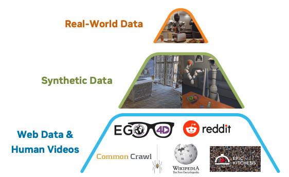

<div class="author-note">

### 필자의 의견

- **합성 데이터 효과의 체계적 검증**. 시뮬레이션 trajectory와 뉴럴 trajectory 두 가지 방식을 동시에 활용, 실제 데이터 대비 40% 성능 향상. 합성 데이터가 핵심 학습 자원이 될 수 있음을 보여줌.
- **Action Data Scaling 문제의 돌파구**. LAPA로 액션 레이블 없는 인간 비디오에서도 학습 가능. 11시간 만에 780K trajectory 생성하는 파이프라인으로 데이터 스케일링의 새 가능성 제시.
- **System 1/2 계층 구조 채택**. VLM(System 2)이 10Hz로 고수준 이해, DiT(System 1)가 120Hz로 저수준 모터 제어. 실시간 제어 제약과 언어-행동 매핑 문제를 동시에 해결하는 실용적 설계.

</div>

## 핵심 의의

- **세계 최초 오픈 휴머노이드 파운데이션 모델**: 휴머노이드 로봇용 오픈 VLA 최초 공개
- **Dual-System 아키텍처**: 인간 인지에서 영감받은 System 2(VLM) + System 1(DiT) 구조
- **합성 데이터의 위력 입증**: 11시간 만에 780K trajectory 생성, 실제 데이터만 사용 대비 40% 성능 향상
- **Cross-Embodiment 지원**: 단일 모델로 다양한 로봇 플랫폼 지원
- **완전 오픈소스**: Apache 2.0 라이선스로 모델, 코드, 평가 시나리오 모두 공개


<p align="center"><em>GR00T N1 아키텍처: System 2 (VLM) + System 1 (Diffusion Transformer) Dual-System 구조</em></p>

---

## Overview

| 항목 | 내용 |
|------|------|
| 발표 | 2025년 3월 18일 (GTC 2025) |
| 타입 | Vision-Language-Action (VLA) |
| 총 파라미터 | 2.2B (22억) |
| VLM 파라미터 | 1.34B (13.4억) |
| 논문 | [arXiv:2503.14734](https://arxiv.org/abs/2503.14734) |
| GitHub | [NVIDIA/Isaac-GR00T](https://github.com/NVIDIA/Isaac-GR00T) |
| Hugging Face | [nvidia/GR00T-N1-2B](https://huggingface.co/nvidia/GR00T-N1-2B) |
| 라이선스 | Apache 2.0 |

---

## Architecture

GR00T N1은 인간의 인지 처리 방식(Kahneman, 2011)에서 영감을 받은 **Dual-System 아키텍처**를 채택합니다.

### System 2: Vision-Language Model (느린 사고)

환경 해석 및 작업 목표 이해를 담당합니다.

| 구성 요소 | 상세 |
|-----------|------|
| 기반 모델 | [Eagle](eagle)2-1B VLM |
| LLM 백본 | Qwen2.5-0.5B-Instruct |
| 이미지 인코더 | SigLIP-2 Vision Transformer |
| 이미지 해상도 | 224x224 |
| 이미지 토큰 | 64개 (픽셀 셔플 적용 후) |
| 실행 주파수 | 10Hz |

**처리 파이프라인:**
1. RGB 카메라 프레임을 SigLIP-2를 통해 처리
2. 텍스트 명령을 T5 인코더로 처리
3. 이미지와 텍스트를 결합하여 환경 및 작업 목표 토큰 생성

### System 1: Diffusion Transformer (빠른 사고)

실시간 모터 액션 생성을 담당합니다.

| 구성 요소 | 상세 |
|-----------|------|
| 아키텍처 | Diffusion Transformer (DiT) |
| 레이어 수 | 16층 |
| 학습 방식 | Action Flow-Matching |
| 조건화 | Adaptive LayerNorm (AdaLN) |
| 실행 주파수 | 120Hz |

**처리 파이프라인:**
1. VLM 출력 토큰과 로봇 고유 수용 감각(proprioceptive state) 수신
2. 교차 어텐션(Cross-Attention)을 통해 정보 통합
3. embodiment 특정(embodiment-specific) 인코더/디코더로 다양한 로봇 플랫폼 지원
4. 디노이징을 통해 부드럽고 정밀한 모터 명령 생성

### 추론 성능

| 항목 | 수치 |
|------|------|
| 추론 시간 | 63.9ms (16 액션 청크) |
| 추론 GPU | NVIDIA L40 (bf16) |
| 메모리 요구량 | ~10-12 GB |

---

## Training

GR00T N1은 "데이터 고립(data island)" 문제를 해결하기 위해 이질적인 데이터 소스를 통합된 피라미드 구조로 조직화합니다.

### Data Pyramid (데이터 피라미드)


<p align="center"><em>GR00T N1 데이터 피라미드: 실제 데이터, 합성 데이터, 웹 스케일 데이터의 계층 구조</em></p>

#### 계층별 데이터 구성

| 계층 | 데이터 유형 | 규모 | 역할 |
|------|-------------|------|------|
| **최상층** | 실제 로봇 원격조작 | ~88시간 (GR00T 휴머노이드) | embodiment 특정 그라운딩 |
| **중간층** | 합성 데이터 | 780K 시뮬레이션 trajectory + ~827시간 뉴럴 trajectory | 데이터 양과 embodiment 특이성 연결 |
| **기반층** | 웹 스케일 비디오 | Ego4D, EPIC-KITCHENS, Assembly-101, HOI4D 등 | 광범위한 시각적/행동적 사전 지식 |

#### 추가 데이터 소스

- **Open X-Embodiment**: 다양한 로봇 플랫폼의 공개 데이터셋
- **AgiBot-Alpha**: 140,000개 trajectory

---

### Latent Action Pre-training (LAPA)

LAPA는 액션 레이블이 없는 비디오(인간 비디오, 웹 비디오)를 학습에 활용하기 위한 핵심 방법론입니다.

#### Latent Action 정의

**Latent Action**은 연속된 비디오 프레임에서 추출한 압축된 동작 정보로, 명시적인 로봇 액션 레이블 없이 동작을 표현합니다.

#### VQ-VAE 아키텍처

```
현재 프레임 (x_t) ─┐
                   ├─→ [Encoder] ─→ Latent Action ─→ [Decoder] ─→ 미래 프레임 재구성
미래 프레임 (x_t+H) ┘
```

| 구성 요소 | 기능 |
|-----------|------|
| **Encoder** | 현재/미래 프레임 쌍에서 잠재 액션 임베딩 추출 |
| **Codebook** | 양자화된 잠재 액션 공간 (공유 모션 어휘) |
| **Decoder** | 잠재 액션 + 현재 프레임으로 미래 프레임 재구성 |

#### 학습 및 추론 과정

1. **VQ-VAE 학습**: 모든 이질적 데이터(로봇 + 인간 비디오)에서 동시 학습
2. **코드북 생성**: embodiment를 넘나드는 통합 잠재 액션 공간 생성
3. **추론 시**: 연속적인 pre-quantized 임베딩을 액션 레이블로 사용
4. **정책 학습**: LAPA를 별도의 "embodiment"로 취급하여 학습

#### Cross-Embodiment 통합

LAPA의 핵심 혁신은 인간 비디오와 로봇 데이터를 **동일한 액션 공간**에서 처리할 수 있다는 것입니다. 코드북이 8개의 서로 다른 embodiment(인간 포함)에서 일관된 의미론을 보여줍니다 (예: "오른팔을 왼쪽으로 이동").

#### LAPA vs IDM 성능 비교

| 데이터 양 | LAPA | IDM | 비고 |
|-----------|------|-----|------|
| 30 시연 | **우수** | 열등 | 저데이터 환경에서 LAPA 우위 |
| 100 시연 | 동등 | 동등 | - |
| 300 시연 | 열등 | **우수** | 데이터 증가 시 IDM 우위 |

> IDM(Inverse Dynamics Model)은 데이터가 많아질수록 실제 액션과의 정렬이 향상됨

---

### Synthetic Data Generation (합성 데이터 생성)

GR00T N1은 두 가지 유형의 합성 데이터를 사용합니다: **시뮬레이션 trajectory**과 **뉴럴 trajectory**.

#### 시뮬레이션 trajectory (GR00T-Mimic / DexMimicGen)

**NVIDIA Isaac GR00T Blueprint** 워크플로우를 사용한 합성 데이터 생성:

| 항목 | 수치 |
|------|------|
| 생성된 trajectory 수 | 780,000개 |
| 생성 시간 | 11시간 |
| 동등 인간 시연 시간 | 6,500시간 (약 9개월 연속 작업) |
| 작업 유형 | 54개 고유 수납공간 카테고리 조합 |

**생성 워크플로우:**

1. **인간 시연 수집**: Leap Motion 장치를 통한 원격조작
2. **서브태스크 분할**: 객체 중심 서브태스크로 시연 분할
3. **자동 변환 및 재생**: 시뮬레이션 환경에서 자동 변환
4. **환경 적응**: 객체 위치 정렬을 통한 환경 적응
5. **품질 필터링**: 성공한 실행만 보존

**주요 특징:**
- RoboCasa 시뮬레이션 프레임워크 기반
- 무작위화된 객체/수납공간 배치 및 방해물 포함
- 물리적으로 유효한 trajectory만 생성 (시뮬레이터 보장)
- Ground-truth 액션 데이터 가용

**주요 도구:**
- **GR00T-Mimic**: 소수의 인간 시연에서 대량의 합성 trajectory 생성
- **NVIDIA Cosmos Transfer**: 포토리얼리스틱 조명, 색상, 텍스처 증강
- **Isaac Lab**: 모방 학습을 통한 로봇 정책 훈련

#### 뉴럴 trajectory (Neural Trajectory)

비디오 생성 모델을 활용한 합성 데이터:

| 항목 | 수치 |
|------|------|
| 총 생성 시간 | ~827시간 (실제 데이터 10배 증강) |
| 생성된 trajectory 수 | ~300,000개 |
| 소요 GPU 시간 | 105,000 L40 GPU-hours (~3,600 GPU에서 1.5일) |

**생성 과정:**

1. **비디오 모델 파인튜닝**: 실제 로봇 데이터로 image-to-video 모델 파인튜닝
2. **시나리오 생성**: 새로운 언어 프롬프트로 다양한 반사실적 시나리오 생성
3. **객체 탐지**: 상용 멀티모달 LLM으로 초기 프레임의 객체 탐지
4. **프롬프트 조합**: "pick {object} from {location A} to {location B}" 조합 생성
5. **후처리 필터링**: LLM 판단을 통한 필터링
6. **재캡셔닝**: 필터링된 비디오의 캡션 재생성

#### Neural vs Synthetic Trajectory 비교

| 측면 | 뉴럴 trajectory | 시뮬레이션 trajectory |
|------|----------|----------------|
| **소스** | 실제 데이터로 파인튜닝된 비디오 생성 모델 | 자동 변환이 적용된 물리 시뮬레이터 |
| **다양성** | 극도로 다양 (액체 붓기 등 희귀 이벤트 가능) | 시뮬레이터 물리 제약으로 제한 |
| **확장성** | 비디오 1초당 2분 소요 | 11시간에 780K trajectory |
| **물리 정확도** | 물리 법칙 위반 가능, 후필터링 필요 | 시뮬레이션에서 물리적 유효성 보장 |
| **액션 레이블** | 잠재 액션 또는 IDM 추론 의사 액션 | Ground-truth 액션 데이터 가용 |
| **반사실적 생성** | 프롬프트로 새 시나리오 쉽게 생성 | 명시적 환경 조작 필요 |

---

### Training Data Composition (학습 데이터 구성)

#### 데이터 소스별 규모

| 데이터 소스 | 규모 | 유형 |
|-------------|------|------|
| GR00T 휴머노이드 실제 데이터 | ~88시간 | 실제 로봇 |
| 시뮬레이션 trajectory | 780,000개 (6,500시간 상당) | 합성 |
| 뉴럴 trajectory | ~300,000개 (~827시간) | 합성 |
| AgiBot-Alpha | 140,000개 trajectory | 실제 로봇 |
| Open X-Embodiment | 다양한 로봇 플랫폼 | 실제 로봇 |
| 인간 비디오 | Ego4D, EPIC-KITCHENS, Assembly-101, HOI4D 등 | 웹 스케일 |

#### 성능 기여도 분석

**뉴럴 trajectory 추가 효과 (Post-training):**

| 벤치마크 | 30 시연 | 100 시연 | 300 시연 |
|----------|---------|----------|----------|
| RoboCasa | +4.2% | +8.8% | +6.8% |

**실제 환경 (GR-1 휴머노이드):**
- 8개 태스크 평균: **+5.8% 개선**

**합성 데이터 vs 실제 데이터만:**
- 전체 성능 향상: **+40%** (합성+실제 데이터 vs 실제 데이터만)

#### 핵심 인사이트

1. 합성 데이터는 일관되게 긍정적인 전이(positive transfer) 효과를 보임
2. 뉴럴 trajectory은 특히 희귀 시나리오와 다양한 조작 태스크에서 효과적
3. 시뮬레이션 trajectory은 물리적으로 유효한 대량 데이터 생성에 효과적
4. 두 유형의 합성 데이터가 상호 보완적으로 작용

---

### Cross-Embodiment Learning

#### Multi-Embodiment 아키텍처

각 embodiment별로 별도의 MLP를 사용하여 상태/액션을 공유 임베딩 차원으로 투영합니다.

**지원 Embodiment 유형:**
- 단일 팔 매니퓰레이터 (Franka Emika Panda)
- 평행 조 그리퍼가 있는 양팔 시스템
- 손재주 있는 손이 있는 양팔 시스템
- 전신 제어 휴머노이드 로봇 (GR-1)
- 잠재 액션 embodiment (LAPA) - 비디오 데이터용

#### 통합 학습 전략

**공동 학습 접근법:**

1. **배치 샘플링**: 이질적 데이터 혼합에서 학습 배치 샘플링
2. **공유 백본**: 공유 비전-언어 백본으로 엔드투엔드 최적화
3. **embodiment별 디코더**: 액션 출력 차원을 위한 embodiment별 디코더
4. **이중 시스템 학습**: System 1 (DiT)과 System 2 (VLM) 동시 학습

#### Cross-Embodiment 일반화

잠재 액션 코드북은 인간과 로봇 사이의 공유 모션 어휘를 생성합니다. 검색된 잠재 임베딩이 8개의 서로 다른 embodiment(인간 및 로봇 형태 포함)에서 일관된 의미론을 보여줍니다.

---

### 학습 인프라

| 항목 | 내용 |
|------|------|
| GPU | 최대 1,024× H100 |
| GR00T-N1-2B 사전학습 | 50,000 H100 GPU-hours |
| 학습 스텝 | 250K steps |
| 배치 크기 | 16,384 |
| 프레임워크 | Isaac Lab + Omniverse |
| 분산 학습 | Ray 기반 커스텀 라이브러리 (내결함성 다중 노드 학습) |
| 오케스트레이션 | NVIDIA OSMO 플랫폼 |

---

## Benchmarks

### 시뮬레이션 벤치마크 (3개 스위트)

| Method | RoboCasa | DexMG | GR-1 Tabletop | 평균 |
|--------|----------|-------|---------------|------|
| BC Transformer | 26.3% | 53.9% | 16.1% | 26.4% |
| Diffusion Policy | 25.6% | 56.1% | 32.7% | 33.4% |
| **GR00T N1 2B** | **32.1%** | **66.5%** | **50.0%** | **45.0%** |

### LIBERO 벤치마크

| 태스크 | N1 성공률 |
|--------|----------|
| LIBERO-Object | 96.7% |
| LIBERO-Spatial | 92.5% |
| LIBERO-Goal | 85.0% |
| LIBERO-Long | 78.3% |

### 실제 환경 테스트 (GR-1 휴머노이드, 10% 학습 데이터)

| 작업 유형 | Diffusion Policy | GR00T N1 2B | 개선율 |
|-----------|------------------|-------------|--------|
| Pick-and-Place | 3.0% | 35.0% | +1067% |
| Articulated | 14.3% | 62.0% | +333% |
| Industrial | 6.7% | 31.0% | +363% |
| Coordination | 27.5% | 50.0% | +82% |
| **평균** | **10.2%** | **42.6%** | **+318%** |

### 언어 지시 준수율

| 항목 | 수치 |
|------|------|
| 언어 지시 준수율 | 46.6% |

> N1.5에서 93.3%로 대폭 개선됨

---

## Capabilities

### 수행 가능 태스크

- 물체 잡기 (grasping)
- 단일/양팔로 물체 이동
- 팔 간 물체 전달 (bimanual handover)
- 장기 컨텍스트가 필요한 다단계 태스크
- 범용 스킬의 조합

### 핵심 특징

| 특징 | 설명 |
|------|------|
| 자연어 이해 | 언어 지시를 이해하고 수행 |
| 동작 모방 | 인간 행동 관찰로 학습 |
| 일반화 | 공통 태스크에 쉽게 일반화 |
| Cross-Embodiment | 다양한 로봇 플랫폼 지원 |

---

## Tested Robots (논문 기준)

GR00T N1 논문에서 실제 테스트된 로봇 플랫폼:

### 실제 로봇

| 플랫폼 | 타입 | 작업 유형 |
|--------|------|-----------|
| [Fourier GR-1](../hardware/humanoids/fourier) | 휴머노이드 | 언어 조건부 양팔 조작 (실제 환경 주력 테스트) |

### 시뮬레이션 벤치마크

| 플랫폼 | 벤치마크 | 작업 유형 |
|--------|----------|-----------|
| [Franka Emika Panda](../hardware/arms/franka-panda) | RoboCasa | 테이블탑 조작 (24개 원자 태스크) |
| Bimanual Panda Arms | DexMimicGen | 양팔 조작 (평행 조 그리퍼) |
| Bimanual Panda Arms + Dexterous Hands | DexMimicGen | 양팔 + 손재주 조작 |
| GR-1 Humanoid | GR-1 Tabletop | 휴머노이드 테이블탑 조작 |

> **참고**: Unitree G1, Agibot Genie-1 등은 [N1.5](groot-n1-5), [N1.6](groot-n1-6)에서 추가로 지원됨

---

## Early Access Partners

[NVIDIA 공식 발표](https://nvidianews.nvidia.com/news/nvidia-isaac-gr00t-n1-open-humanoid-robot-foundation-model-simulation-frameworks) 기준:

| 회사 | 로봇/플랫폼 | 비고 |
|------|-------------|------|
| [1X Technologies](../companies/1x) | [NEO](../hardware/humanoids/neo) | GTC 2025 키노트에서 자율 가정 정리 시연 |
| Agility Robotics | [Digit](../hardware/humanoids/digit) | |
| Boston Dynamics | [Atlas](../hardware/humanoids/atlas) | |
| Mentee Robotics | MenteeBot | |
| NEURA Robotics | 4NE-1 | |

---

## Authors

**Project Leads:**
- [Linxi "Jim" Fan](../people/jim-fan) - NVIDIA GEAR Lab 공동 리드
- [Yuke Zhu](../people/yuke-zhu) - NVIDIA GEAR Lab 공동 리드, UT Austin 부교수

**핵심 저자 (일부):**
- Dieter Fox - NVIDIA, University of Washington
- Jan Kautz - NVIDIA VP of Learning and Perception Research
- Ajay Mandlekar - NVIDIA Research
- Soroush Nasiriany - NVIDIA Research
- 외 41명

---

## Installation

### 시스템 요구사항

**Fine-tuning용:**
- OS: Ubuntu 20.04 / 22.04
- GPU: H100, L40, RTX 4090, A6000
- Python: 3.10
- CUDA: 12.4

**Inference용:**
- OS: Ubuntu 20.04 / 22.04
- GPU: RTX 3090, RTX 4090, A6000

### 설치 방법

```bash
# Conda 환경 생성
conda create -n gr00t python=3.10
conda activate gr00t

# 의존성 설치
pip install --upgrade setuptools
pip install -e .[base]
pip install --no-build-isolation flash-attn==2.7.1.post4
```

---

## References

- [NVIDIA Newsroom - GR00T N1](https://nvidianews.nvidia.com/news/nvidia-isaac-gr00t-n1-open-humanoid-robot-foundation-model-simulation-frameworks)
- [arXiv Paper - GR00T N1](https://arxiv.org/abs/2503.14734)
- [NVIDIA Research](https://research.nvidia.com/publication/2025-03_nvidia-isaac-gr00t-n1-open-foundation-model-humanoid-robots)
- [NVIDIA Developer Blog](https://developer.nvidia.com/blog/accelerate-generalist-humanoid-robot-development-with-nvidia-isaac-gr00t-n1/)
- [GitHub - Isaac-GR00T](https://github.com/NVIDIA/Isaac-GR00T)
- [Hugging Face - GR00T-N1-2B](https://huggingface.co/nvidia/GR00T-N1-2B)

---

## See Also

### GR00T 시리즈
- [GR00T](groot) - 시리즈 개요
- [GR00T N1.5](groot-n1-5) - 언어 이해 개선
- [GR00T N1.6](groot-n1-6) - 스케일 확대

### 관련 모델
- [Eagle](eagle) - N1의 VLM
- [DreamGen](dreamgen) - 합성 데이터 생성 파이프라인

### 관련 인물
- [Jim Fan](../people/jim-fan) - NVIDIA GEAR Lab, GR00T 연구 리드
