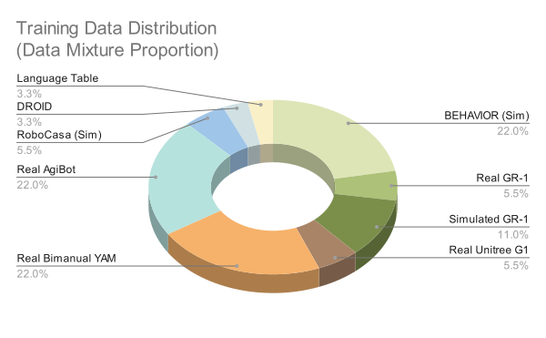

## 핵심 의의

- **최초 오픈 휴머노이드 파운데이션 모델**: GR00T N1으로 휴머노이드 로봇용 오픈 VLA 최초 공개
- **Dual-System 구조**: 인간 인지에서 영감 - System 2(VLM, 계획/추론)와 System 1(Diffusion, 실시간 동작) 분리
- **합성 데이터의 위력 입증**: Omniverse로 11시간 만에 780K 궤적(6,500시간) 생성, 실제 데이터만 사용 대비 40% 성능 향상
- **NVIDIA 생태계 통합**: Isaac Sim/Lab, Omniverse, Jetson Thor까지 하드웨어-소프트웨어 수직 통합
- **산업 전체의 공통 플랫폼**: Figure AI, Boston Dynamics, Unitree 등 주요 휴머노이드 회사들과 협력
- **Jetson Thor 전용 하드웨어**: 800 TFLOPS의 Blackwell 기반 로봇 전용 컴퓨팅 플랫폼 발표
- **시뮬레이션 기반 스케일링의 대표 사례**: 실제 데이터 수집 없이 대규모 학습 가능성 제시
- **지속적 개선 (N1.5/N1.6)**: 언어 지시 준수 46.6%→93.3% (N1.5), DiT 2배 확대 및 Cosmos VLM 도입 (N1.6)

<em>GR00T N1 아키텍처: System 2(VLM) + System 1(Diffusion Transformer) Dual-System 구조</em>

<em>GR00T N1.6: 다양한 조작 태스크 수행 데모</em>

---

## Overview

GR00T(Generalist Robot 00 Technology)는 NVIDIA가 2024년 GTC에서 발표하고, 2025년 N1 시리즈로 오픈소스화한 휴머노이드 로봇 범용 파운데이션 모델입니다.

| 항목 | 내용 |
|------|------|
| 최초 발표 | 2024년 3월 18일 (GTC 2024) |
| N1 공개 | 2025년 3월 (GTC 2025) |
| 회사 | NVIDIA |
| 논문 | [arXiv:2503.14734](https://arxiv.org/abs/2503.14734) |
| GitHub | [NVIDIA/Isaac-GR00T](https://github.com/NVIDIA/Isaac-GR00T) |
| 라이선스 | Apache 2.0 (오픈소스) |

---

## Versions

### Project GR00T (2024.03)

GTC 2024에서 최초 발표. 휴머노이드 로봇을 위한 파운데이션 모델 비전 제시.
- 자연어 이해, 인간 동작 모방, 시뮬레이션 기반 학습 목표 발표
- Jetson Thor 컴퓨팅 플랫폼 동시 발표

### GR00T N1 (2025.03)

세계 최초 **오픈 휴머노이드 로봇 파운데이션 모델**.

| 항목 | 내용 |
|------|------|
| 타입 | Vision-Language-Action (VLA) |
| 구조 | Dual-system architecture |
| 액션 생성 | Diffusion Transformer |
| VLM | Eagle2-1B |
| DiT | 16 layers |
| 학습 | 1K H100 GPUs, 250K steps |

### GR00T N1.5 (2025.05)

언어 지시 준수 능력 대폭 향상.

| 항목 | 내용 |
|------|------|
| 핵심 개선 | **Frozen VLM** (학습 중 VLM 고정) |
| 손실 함수 | **FLARE Loss** (Flow-based Action Reconstruction) |
| 언어 준수율 | 46.6% → **93.3%** (+100%) |
| VLM | Eagle2-1B (Frozen) |
| DiT | 16 layers |

**주요 개선점:**
- VLM을 고정하여 언어 이해 능력 보존
- FLARE loss로 행동 예측과 언어 준수 균형 최적화
- 기존 대비 언어 지시 준수율 2배 이상 향상

### GR00T N1.6 (2025.06)

모델 스케일 확대 및 실제 환경 성능 향상.

| 항목 | 내용 |
|------|------|
| 핵심 개선 | **2x 더 큰 DiT**, **Cosmos VLM** |
| VLM | **Cosmos-2B** (기존 Eagle2-1B 대비 2배) |
| DiT | **32 layers** (기존 16 대비 2배) |
| Action Space | **Relative Action Space** |
| 실제 환경 | 시뮬레이션-실제 전이 성능 향상 |

**주요 개선점:**
- Diffusion Transformer를 32 레이어로 2배 확대
- Cosmos-2B VLM으로 시각적 이해 능력 강화
- 상대적 행동 공간(Relative Action Space) 도입으로 일반화 향상
- 시뮬레이션에서 실제 환경으로의 전이 성능 개선

### 버전별 비교

| 항목 | N1 | N1.5 | N1.6 |
|------|-----|------|------|
| VLM | Eagle2-1B | Eagle2-1B (Frozen) | Cosmos-2B |
| DiT Layers | 16 | 16 | **32** |
| 언어 준수율 | 46.6% | **93.3%** | 93%+ |
| Action Space | Absolute | Absolute | **Relative** |
| 핵심 기여 | 첫 오픈 모델 | 언어 준수 개선 | 스케일 확대 |

---

## Architecture

GR00T N1은 인간 인지 원리에서 영감받은 **Dual-System 구조**입니다.

### System 2 (Slow Thinking)
- Vision-Language Model 기반
- 환경과 지시를 이해하여 행동 계획 수립
- 신중하고 방법론적인 의사결정

### System 1 (Fast Thinking)
- Diffusion Transformer 기반
- 계획을 정밀한 연속 동작으로 변환
- 인간의 반사/직관에 해당

---

## Training

### 데이터 소스

| 소스 | 설명 |
|------|------|
| 인간 시연 데이터 | 실제 사람의 동작 (텔레오퍼레이션) |
| 합성 데이터 | NVIDIA Omniverse/Isaac Sim 생성 |
| 인간 비디오 | 동작 사전학습용 |

<em>GR00T 학습 데이터 분포: 실제 데이터와 합성 데이터의 조합</em>

### Synthetic Data의 위력

Omniverse를 통한 합성 데이터 생성의 효율성:

| 항목 | 수치 |
|------|------|
| 생성된 합성 궤적 | 780,000개 |
| 실시간 환산 | 6,500시간 (9개월 연속) |
| 생성 소요 시간 | **11시간** |
| 성능 향상 | 실제 데이터만 사용 대비 **+40%** |

### 학습 인프라

| 항목 | 내용 |
|------|------|
| GPU | 1,000× H100 |
| 학습 스텝 | 250K steps |
| 프레임워크 | Isaac Lab + Omniverse |

---

## Capabilities

### 수행 가능 태스크

- 물체 잡기 (grasping)
- 단일/양팔로 물체 이동
- 팔 간 물체 전달
- 장기 컨텍스트가 필요한 다단계 태스크
- 범용 스킬의 조합

### 핵심 특징

| 특징 | 설명 |
|------|------|
| 자연어 이해 | 언어 지시를 이해하고 수행 |
| 동작 모방 | 인간 행동 관찰로 학습 |
| 일반화 | 공통 태스크에 쉽게 일반화 |

---

## Hardware: Jetson Thor

GR00T 실행을 위해 설계된 새로운 컴퓨팅 플랫폼.

| 항목 | 스펙 |
|------|------|
| GPU 아키텍처 | NVIDIA Blackwell |
| AI 성능 | 800 TFLOPS (8-bit FP) |
| Transformer Engine | 내장 |
| 설계 | 모듈형, 성능/전력/크기 최적화 |

---

## Ecosystem: Isaac Platform

GR00T는 NVIDIA Isaac 로보틱스 플랫폼의 일부입니다.

| 구성 요소 | 역할 |
|----------|------|
| Isaac Sim | 시뮬레이션 환경 |
| Isaac Lab | 강화학습 프레임워크 |
| Omniverse | 합성 데이터 생성 |
| GR00T | 파운데이션 모델 |

---

## Industry Partners

NVIDIA는 주요 휴머노이드 로봇 회사들과 협력 중:

- 1X Technologies
- Agility Robotics
- Apptronik
- Boston Dynamics
- Figure AI
- Fourier Intelligence
- Sanctuary AI
- Unitree Robotics
- XPENG Robotics

---

## Cross-Embodiment

GR00T는 다양한 로봇 형태를 지원하도록 설계:

| 지원 로봇 | 타입 |
|----------|------|
| Fourier GR-1 | 휴머노이드 |
| Unitree G1/H1 | 휴머노이드 |
| Agility Digit | 휴머노이드 |
| ALOHA | 양팔 조작기 |
| Franka | 단일 팔 |

---

## Benchmarks

### LIBERO 벤치마크 (시뮬레이션)

| 태스크 | N1 성공률 |
|--------|----------|
| LIBERO-Object | 96.7% |
| LIBERO-Spatial | 92.5% |
| LIBERO-Goal | 85.0% |
| LIBERO-Long | 78.3% |

### 언어 지시 준수 (Language Following)

| 버전 | 준수율 |
|------|--------|
| N1 | 46.6% |
| N1.5 | **93.3%** |
| N1.6 | 93%+ |

---

## Impact

GR00T 시리즈의 의의:

**N1 (2025.03)**
- **최초 오픈 휴머노이드 파운데이션 모델**
- 시뮬레이션 기반 **대규모 합성 데이터** 활용 입증
- Dual-system 구조로 **계획과 실행 분리**

**N1.5 (2025.05)**
- VLM 고정으로 **언어 이해 능력 보존** 문제 해결
- FLARE loss로 **행동 학습과 언어 준수의 균형** 달성

**N1.6 (2025.06)**
- 모델 스케일 확대로 **표현력 향상**
- Relative action space로 **일반화 능력 강화**
- 휴머노이드 산업 전체를 위한 **공통 플랫폼** 제공

---

## References

### GR00T N1
- [NVIDIA Newsroom - GR00T N1](https://nvidianews.nvidia.com/news/nvidia-isaac-gr00t-n1-open-humanoid-robot-foundation-model-simulation-frameworks)
- [arXiv Paper - GR00T N1](https://arxiv.org/abs/2503.14734)

### GR00T N1.5
- [NVIDIA Research - GR00T N1.5](https://research.nvidia.com/labs/gear/gr00t-n1_5/)

### GR00T N1.6
- [NVIDIA Research - GR00T N1.6](https://research.nvidia.com/labs/gear/gr00t-n1_6/)

### Project GR00T
- [NVIDIA Newsroom - Project GR00T](https://nvidianews.nvidia.com/news/foundation-model-isaac-robotics-platform)
- [NVIDIA Developer - Isaac GR00T](https://developer.nvidia.com/isaac/gr00t)
- [GitHub - Isaac-GR00T](https://github.com/NVIDIA/Isaac-GR00T)
- [IEEE Spectrum Article](https://spectrum.ieee.org/nvidia-gr00t-ros)

---

## See Also

- [모델 목록](index)
- [NVIDIA](../companies/nvidia)
- [시뮬레이션 & World Model](../solutions/simulation-world-model)

### 관련 인물
- [Jim Fan](../people/jim-fan) - NVIDIA GEAR Lab, GR00T 연구 리드

