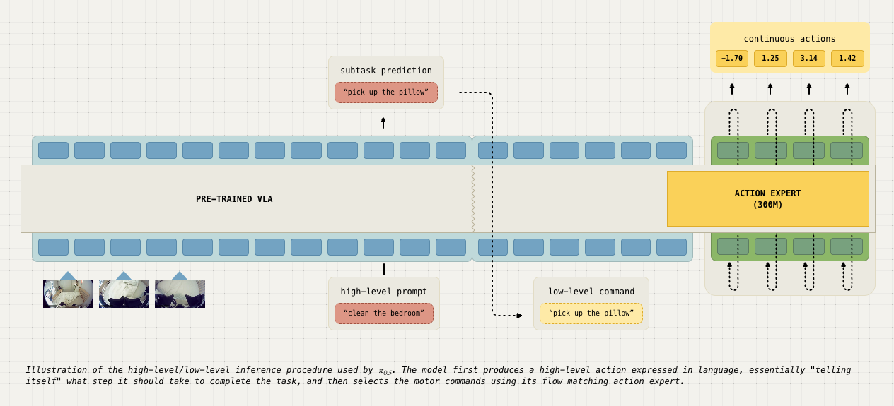

<div class="author-note">

### 필자의 의견

- **실험실 → 실제 환경의 전환점**. 학습하지 않은 새로운 가정에서 동작한다는 것은 로봇 일반화 연구의 중요한 이정표. 기존 VLA들이 실험실 수준에 머물렀다면, π0.5는 실제 배포 가능성을 보여줌.
- **Web 데이터 활용의 핵심 증거**. VLM의 인터넷 스케일 지식을 로봇에 전이하는 것이 일반화에 핵심이라는 것을 실증. OOD 객체 인식에서 Web 데이터의 효과가 가장 컸음.
- **~100개 환경 스케일링 법칙**. 데이터 수집의 실용적 가이드라인 제시. 무한히 많은 환경이 필요한 것이 아니라 ~100개 환경이면 충분하다는 점은 산업적으로 의미 있음.

</div>

## 핵심 의의

- **Open-World 일반화**: 학습하지 않은 완전히 새로운 가정에서도 작동 - 로봇 일반화의 새로운 기준
- **Web 데이터 Co-training**: 이미지 캡셔닝, Visual QA, 객체 탐지 등 웹 데이터와 로봇 데이터 동시 학습
- **Dual-Pathway 추론**: 고수준 의미 액션 + 저수준 모터 명령을 동일 모델에서 생성
- **실제 가정 검증**: 샌프란시스코 3개 렌탈 주택에서 주방/침실 정리 태스크 수행
- **Scaling Law 발견**: ~100개 학습 환경 후 성능이 포화 - 실용적 데이터 요구량 제시


<p align="center"><em>π0.5: Open-world 일반화를 위한 Co-training 아키텍처</em></p>

---

## Overview

π0.5는 Physical Intelligence가 2025년 4월 발표한 open-world generalization VLA입니다. 기존 VLA들이 학습 환경과 유사한 곳에서만 작동하는 한계를 극복하고, 완전히 새로운 환경에서도 의미 있는 성능을 보여줍니다.

| 항목 | 내용 |
|------|------|
| 발표 | 2025년 4월 22일 |
| 회사 | Physical Intelligence |
| 논문 | [arXiv:2504.16054](https://arxiv.org/abs/2504.16054) |
| 블로그 | [pi.website/blog/pi05](https://www.pi.website/blog/pi05) |
| 기반 | π0 |

---

## Key Innovation: Open-World Generalization

### 기존 VLA의 한계

| 기존 VLA | π0.5 |
|---------|------|
| 학습 환경과 유사한 곳에서만 작동 | **완전히 새로운 환경에서도 작동** |
| 실험실 수준 | **실제 가정 수준** |
| 특정 물체에 특화 | **처음 보는 물체도 처리** |

### 검증

- **장소**: 샌프란시스코 3개 렌탈 주택
- **조건**: 학습 데이터에 전혀 없는 새로운 환경
- **태스크**: 주방 정리, 침실 정리, 식기 세척 등

---

## Architecture

### Co-training Strategy

π0.5는 다양한 데이터 소스를 동시에 학습합니다. 전체 학습 데이터의 97.6%는 모바일 매니퓰레이터 이외의 소스에서 옵니다.

### 데이터 유형별 역할

| 데이터 유형 | 역할 |
|------------|------|
| **Web 데이터** | 이미지 캡셔닝, Visual QA, 객체 탐지 → 시각 이해 |
| **언어 시연** | 단계별 지시 학습 → 언어 지시 따르기 |
| **서브태스크 명령** | 고수준 의미 레이블 → 계층적 이해 |
| **로봇 액션** | 다중 embodiment → 물리적 제어 |

---

## Dual-Pathway Inference


<p align="center"><em>π0.5 Dual-Pathway Inference</em></p>

π0.5는 동일 모델에서 두 가지 수준의 출력을 **순차적으로** 생성합니다.

### 추론 순서

1. **High-Level**: VLM이 서브태스크 텍스트 토큰을 autoregressive하게 먼저 생성
2. **Low-Level**: 생성된 서브태스크를 조건으로 Action Expert가 flow matching으로 continuous action 생성

> 중요: Low-level action은 원래 지시(ℓ)가 아닌 **예측된 서브태스크(ℓ̂)에만 조건화**됨

### 학습 방식

| 단계 | 방식 |
|------|------|
| Pre-training | FAST tokenization으로 discrete action 학습 (효율적 next-token prediction) |
| Post-training | Action Expert 추가하여 continuous action 생성 학습 (flow matching) |

### Chain-of-Thought 효과

```
"침실 정리해줘"
    ↓
"베개를 집어" (discrete) → [모터 명령] (continuous)
    ↓
"이불을 펴" (discrete) → [모터 명령] (continuous)
    ↓
...
```

---

## Training Data Ablation

### 데이터 유형별 효과

| 데이터 | 효과 |
|--------|------|
| **Web 데이터** | OOD 객체 인식에서 가장 큰 효과 |
| **Cross-Embodiment (CE)** | ~17-18% 성능 향상 |
| **Multiple Environment (ME)** | ~33-66% 성능 향상 |

### Scaling Study

| 학습 환경 수 | 성능 |
|-------------|------|
| 10개 | 기준선 |
| 50개 | 상당한 향상 |
| **~100개** | **성능 포화** |

**인사이트**: ~100개 환경 후 테스트 환경에서 직접 학습한 것과 유사한 성능

---

## Performance

### Open-World 태스크

| 환경 | 태스크 | 성능 |
|------|--------|------|
| 새 주방 | 식기 세척기에 넣기 | 수행 가능 |
| 새 침실 | 베드 메이킹 | 수행 가능 |
| 새 거실 | 물체 정리 | 수행 가능 |

### 특징

- **반응형 정책**: 환경 변화와 인간 간섭에 대응
- **언어 유연성**: "접시를 싱크대에" ~ "그릇들 치워"
- **객체 일반화**: 처음 보는 물체도 카테고리 수준 이해

### 한계

| 한계 | 설명 |
|------|------|
| **하드웨어 일반화** | 익숙하지 않은 서랍 손잡이, 캐비닛 물리 등에서 어려움 |
| **부분 관측성** | 청소 중 팔이 시야를 가리는 문제 |
| **고수준 추론 산만** | High-level inference가 쉽게 산만해짐 |
| **프롬프트 복잡도** | 학습 어노테이션 기반으로 제한된 프롬프트만 지원 |
| **컨텍스트 윈도우** | 좁은 컨텍스트로 방 간 이동에 제한 |
| **다중 시도 필요** | 익숙하지 않은 태스크에서 여러 번 시도 필요 |

---

## Comparison with π0

| 항목 | π0 | π0.5 |
|------|-----|------|
| 일반화 | 학습 환경 내 | **새로운 환경** |
| 학습 데이터 | 로봇 데이터 위주 | **Web + 로봇** |
| Mock Home 성능 | ~35% | **~65%** |
| 고수준 추론 | 없음 | **Dual-Pathway** |

---

## Real-World Testing

### 테스트 환경

- **위치**: 샌프란시스코
- **유형**: 3개 렌탈 주택
- **조건**: 학습 데이터에 전혀 없음

### 수행 태스크

| 태스크 | 복잡도 |
|--------|--------|
| 주방 정리 | 다중 물체, 다중 위치 |
| 침실 정리 | 베드 메이킹, 베개 배치 |
| 식기 세척 | 싱크대 → 식기세척기 |

### 관찰 결과

> "사람이 새로운 도전에 접근하는 유연함과 자원 활용의 힌트를 보여줌"

- 완벽하지는 않지만 의미 있는 진전
- 기존 VLA로는 불가능했던 수준

---

## Technical Details

### Model Specifications

| 구성 요소 | 사양 |
|----------|------|
| VLM Backbone | 3B |
| Action Expert | 300M |
| 총 파라미터 | ~3.3B |
| 제어 주파수 | 50Hz |

### Training

| 항목 | 내용 |
|------|------|
| 기반 | π0 체크포인트 |
| Pre-training | 280k gradient steps |
| Post-training | 80k gradient steps |
| 추가 | Web 데이터, Verbal Instruction co-training |

---

## Related Research: Knowledge Insulation

π0.5에 추가로 적용할 수 있는 별도 연구 기여물입니다.

### 개념

Knowledge Insulation (KI)은 VLM 백본에 내장된 지식이 로봇 학습 중 손상되는 것을 방지하는 학습 기법입니다.

### 작동 방식

| 문제 | 해결책 |
|------|--------|
| Action Expert → VLM 역전파 | **Gradient Blocking** |
| 로봇 학습이 언어 이해 손상 | **FAST 이산화 액션으로 표현 학습** |

### 결과 (π0.5 + KI)

- π0 대비 **7.5배 적은 학습 스텝**
- 언어 지시 준수율 향상
- 시각적 이해 능력 보존

> 자세한 내용: [Knowledge Insulation Research](https://www.pi.website/research/knowledge_insulation)

---

## References

- [arXiv Paper](https://arxiv.org/abs/2504.16054)
- [Physical Intelligence Blog - π0.5](https://www.pi.website/blog/pi05)
- [Knowledge Insulation Research](https://www.pi.website/research/knowledge_insulation)

---

## See Also

- [π Series](pi-series)
- [π0](pi0)
- [π*0.6](pi0-6-star)
- [Physical Intelligence](../companies/physical-intelligence)

### 관련 인물
- [Karol Hausman](../people/karol-hausman) - Physical Intelligence 공동창업자
- [Chelsea Finn](../people/chelsea-finn) - Physical Intelligence 공동창업자
- [Sergey Levine](../people/sergey-levine) - Physical Intelligence 공동창업자
- [Pete Florence](../people/pete-florence) - Physical Intelligence 공동창업자

