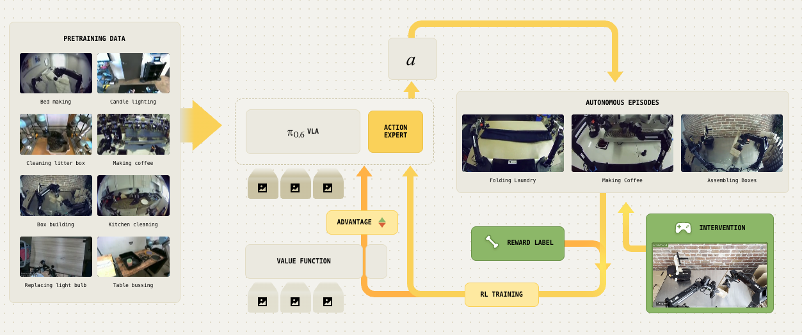

## 핵심 의의

- **VLA의 RL 자가 개선**: 배포 후 실제 경험에서 학습하여 지속적 성능 향상
- **RECAP 방법론**: RL with Experience & Corrections via Advantage-conditioned Policies
- **90%+ 성공률**: 다양한 실세계 태스크에서 90% 이상 성공률 달성
- **2배 처리량**: 어려운 태스크에서 처리량 2배 이상 향상
- **24시간 연속 운영**: 에스프레소 제조 5:30am~11:30pm, 50개 빨래 연속 접기
- **공장 배포**: 59개 초콜릿 포장 박스 조립 실증
- **Value Function 기반**: 상황별 성공 확률 예측으로 신용 할당 문제 해결


<p align="center"><em>π*0.6: RECAP - 경험과 코칭에서 학습하는 강화학습</em></p>

---

## Overview

π*0.6는 Physical Intelligence가 2025년 11월 발표한 RL 기반 자가 개선 VLA입니다. 기존 imitation learning의 한계를 극복하고, 실제 배포 환경에서의 경험을 통해 지속적으로 성능을 향상시킵니다.

| 항목 | 내용 |
|------|------|
| 발표 | 2025년 11월 17일 |
| 회사 | Physical Intelligence |
| 블로그 | [pi.website/blog/pistar06](https://www.pi.website/blog/pistar06) |
| 논문 | [pi.website/download/pistar06.pdf](https://www.pi.website/download/pistar06.pdf) |
| 기반 | π0.5 |

---

## Why RL for VLAs?

### Imitation Learning의 한계

| 문제 | 설명 |
|------|------|
| **데이터 한계** | 시연 데이터의 품질에 종속 |
| **실패 복구** | 실패 상황 데이터 부족 |
| **오류 누적** | 작은 오류가 누적되어 실패 |
| **천장 효과** | 시연자의 성능을 넘기 어려움 |

### RL의 장점

| 장점 | 설명 |
|------|------|
| **경험 학습** | 실제 실패/성공에서 학습 |
| **자가 개선** | 시연 품질을 초과 가능 |
| **실패 복구** | 실패 상황에서 복구 학습 |

---

## RECAP: Core Method

RECAP (RL with Experience & Corrections via Advantage-conditioned Policies)

### 3단계 학습 파이프라인

```
┌─────────────────────────────────────────────────────────────┐
│                    RECAP Learning Pipeline                   │
├─────────────────────────────────────────────────────────────┤
│                                                              │
│   Stage 1: Demonstration                                     │
│   ┌──────────────────────────────────────────────────┐      │
│   │  텔레오퍼레이션으로 초기 시연 데이터 수집        │      │
│   └──────────────────────────────────────────────────┘      │
│                           ↓                                  │
│   Stage 2: Autonomous Deployment                             │
│   ┌──────────────────────────────────────────────────┐      │
│   │  자율 실행 → 성공/실패 경험 수집                 │      │
│   └──────────────────────────────────────────────────┘      │
│                           ↓                                  │
│   Stage 3: Coaching (Expert Intervention)                    │
│   ┌──────────────────────────────────────────────────┐      │
│   │  실패 시 전문가가 개입하여 올바른 행동 시연      │      │
│   └──────────────────────────────────────────────────┘      │
│                           ↓                                  │
│   RL Training with Value Function                            │
│   ┌──────────────────────────────────────────────────┐      │
│   │  Advantage conditioning으로 좋은 행동 강화       │      │
│   └──────────────────────────────────────────────────┘      │
│                                                              │
└─────────────────────────────────────────────────────────────┘
```

### Value Function

**핵심 역할**: 현재 상황이 얼마나 "좋은지" 예측

```
관측 상태 → Value Function → 성공 확률 예측 (0~1)
```

| 상황 | Value |
|------|-------|
| 목표 달성 중 | 높음 (증가) |
| 정체 중 | 낮음 (평탄) |
| 실패 방향 | 매우 낮음 (감소) |

**예시 - 에스프레소 제조:**
- 컵 잡기 성공 → Value ↑
- 기계 앞으로 이동 → Value ↑
- 진행 없음 → Value 평탄
- 컵 놓침 → Value ↓

### Advantage Conditioning

```
Advantage = V(s') - V(s)  (다음 상태 value - 현재 상태 value)
```

| Advantage | 의미 | 학습 |
|-----------|------|------|
| 양수 (+) | 좋은 행동 | 강화 |
| 음수 (-) | 나쁜 행동 | 억제 |

**핵심**: 모델을 advantage에 조건화하여 "좋은 행동만" 생성하도록 학습

### Coaching Mechanism

| 방식 | 설명 |
|------|------|
| **개입 시점** | 로봇이 실수할 때 |
| **개입 방법** | 전문가가 텔레오퍼레이션으로 교정 |
| **장점** | 실제 문제 상황에서의 데이터 수집 |

> "초기 시연만으로는 정책이 실제로 마주치는 상황을 커버하지 못함"

---

## Performance Results

### Success Rate

| 메트릭 | 결과 |
|--------|------|
| 전체 성공률 | **90%+** |
| 실패율 감소 | **2배 이상** |

### Throughput

| 태스크 | 개선 |
|--------|------|
| 에스프레소 제조 | **2배+ 처리량** |
| 어려운 조작 태스크 | 상당한 향상 |

### Real-World Deployment

| 태스크 | 성과 |
|--------|------|
| **에스프레소 제조** | 5:30am ~ 11:30pm 연속 운영 |
| **빨래 접기** | 50개 새 아이템 연속 처리 |
| **박스 조립** | 59개 초콜릿 포장 박스 (공장) |

---

## Architecture

### vs π0.5

| 항목 | π0.5 | π*0.6 |
|------|------|-------|
| 학습 방식 | Imitation Learning | **+ Reinforcement Learning** |
| Backbone | 3B | **약간 더 큰 backbone** |
| 조건화 | 언어 + 이미지 | **+ Advantage conditioning** |
| 개선 | 정적 | **배포 후 지속 개선** |

### Model Components

```
┌─────────────────────────────────────────────────────────────┐
│                    π*0.6 Architecture                        │
├─────────────────────────────────────────────────────────────┤
│                                                              │
│   ┌────────────────────────────────────────────────────┐    │
│   │                  π0.5 Base Model                   │    │
│   │              (VLM + Action Expert)                 │    │
│   └───────────────────────┬────────────────────────────┘    │
│                           │                                  │
│                           ▼                                  │
│   ┌────────────────────────────────────────────────────┐    │
│   │               Value Function V(s)                  │    │
│   │            상황별 성공 확률 예측                   │    │
│   └───────────────────────┬────────────────────────────┘    │
│                           │                                  │
│                           ▼                                  │
│   ┌────────────────────────────────────────────────────┐    │
│   │          Advantage-Conditioned Policy              │    │
│   │         좋은 행동(A>0)에 조건화된 출력             │    │
│   └────────────────────────────────────────────────────┘    │
│                                                              │
└─────────────────────────────────────────────────────────────┘
```

---

## Training Pipeline

### Phase 1: Offline RL Pre-training

```
시연 데이터 + 경험 데이터 → Offline RL → π* (base policy)
```

- 기존 데이터로 초기 정책 학습
- Value function 동시 학습

### Phase 2: Online Deployment + Coaching

```
π* 배포 → 자율 실행 → 실패 시 코칭 → 데이터 수집
```

- 실제 환경에서 경험 축적
- 전문가 개입으로 교정 데이터 확보

### Phase 3: RL Fine-tuning

```
경험 데이터 + 코칭 데이터 → RL 업데이트 → π*' (개선된 정책)
```

- Advantage conditioning으로 좋은 행동 강화
- 반복적 개선

---

## Credit Assignment Problem

### 문제

> "어떤 행동이 성공/실패를 야기했는가?"

에피소드가 끝난 후에야 결과를 알 수 있음

### 해결: Value Function

| 접근 | 방법 |
|------|------|
| **Value 학습** | 각 상태의 성공 확률 예측 |
| **Advantage 계산** | 상태 전이의 가치 변화 측정 |
| **신용 할당** | 개별 행동의 기여도 평가 |

**체스 비유:**
- Value function = 현재 보드 상태의 승률 예측
- Advantage = 수를 둔 후 승률 변화
- 좋은 수 = 승률 상승, 나쁜 수 = 승률 하락

---

## Real-World Demonstrations

### Espresso Making

| 단계 | 동작 |
|------|------|
| 1 | 컵 집기 |
| 2 | 에스프레소 기계로 이동 |
| 3 | 컵 배치 |
| 4 | 버튼 누르기 |
| 5 | 완성된 음료 제공 |

**운영**: 5:30am ~ 11:30pm (18시간 연속)

### Laundry Folding

- **50개** 처음 보는 의류 아이템
- **연속 처리** (중단 없음)
- **다양한 형태**: 셔츠, 바지, 수건 등

### Factory Box Assembly

- **59개** 초콜릿 포장 박스
- **실제 공장 환경**
- **생산 라인 통합**

---

## Comparison with Other RL Approaches

| 접근 | RECAP | 기존 Robot RL |
|------|-------|--------------|
| 데이터 | 이질적 (시연+경험+코칭) | 동질적 |
| 환경 | 실제 환경 | 주로 시뮬레이션 |
| 리셋 | 불완전 리셋 처리 | 완전 리셋 가정 |
| 스케일 | 대규모 VLA | 작은 정책 |

---

## Limitations & Future Work

### 현재 한계

| 한계 | 설명 |
|------|------|
| 코칭 비용 | 전문가 개입 필요 |
| 배포 시간 | 충분한 경험 수집 필요 |
| 안전성 | 실패 시 물리적 위험 |

### 미래 방향

- 자동 코칭 (AI 기반)
- 시뮬레이션 → 실제 전이
- 더 효율적인 exploration

---

## References

- [Physical Intelligence Blog - π*0.6](https://www.pi.website/blog/pistar06)
- [Technical Report](https://www.pi.website/download/pistar06.pdf)

---

## See Also

- [π Series](pi-series.md)
- [π0](pi0.md)
- [π0.5](pi0-5.md)
- [Physical Intelligence](../companies/physical-intelligence.md)

### 관련 인물
- [Karol Hausman](../people/karol-hausman.md) - Physical Intelligence 공동창업자
- [Chelsea Finn](../people/chelsea-finn.md) - Physical Intelligence 공동창업자
- [Sergey Levine](../people/sergey-levine.md) - Physical Intelligence 공동창업자
- [Pete Florence](../people/pete-florence.md) - Physical Intelligence 공동창업자

