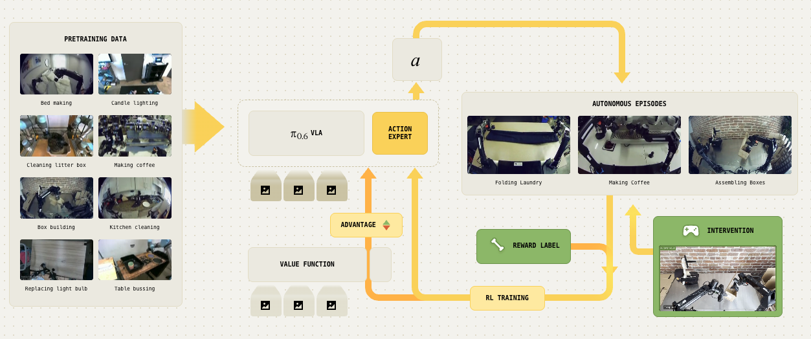
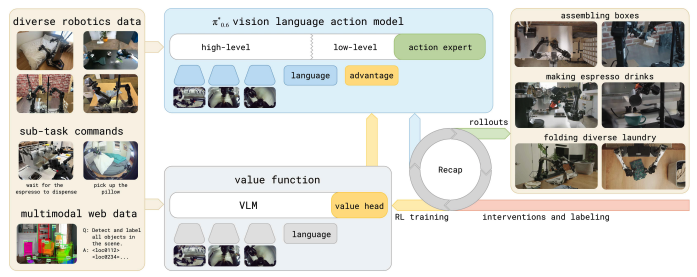

<div class="author-note">

### 필자의 의견

- **VLA + RL의 실용적 증명**. 대규모 VLA에 RL을 적용하여 실제 환경에서 자가 개선이 가능하다는 것을 실증. 시뮬레이션이 아닌 실제 로봇에서 RL이 작동함을 보여줌.
- **Coaching의 핵심 역할**. 단순 자율 경험 수집만으로는 부족하고, 실패 상황에서의 전문가 개입(코칭)이 성능 향상에 핵심적. 완전 자율 학습까지는 아직 갈 길이 있음.
- **Binarized Advantage의 단순함**. 복잡한 advantage 수치 대신 "positive/negative" 텍스트로 조건화하는 단순한 방식이 효과적. VLA의 언어 이해 능력을 활용한 영리한 설계.

</div>

## 핵심 의의

- **VLA의 RL 자가 개선**: 배포 후 실제 경험에서 학습하여 지속적 성능 향상
- **RECAP 방법론**: 시연 + 자율 경험 + 코칭 데이터를 통합한 RL 학습
- **90%+ 성공률**: T-shirt folding 97%, Box assembly ~90% 등 고성능 달성
- **2배+ 처리량 향상**: 어려운 태스크에서 처리량 2배 이상, 실패율 절반 감소
- **24시간 연속 운영**: 에스프레소 5:30am~11:30pm, 50개 빨래 연속 접기
- **공장 배포 실증**: 59개 초콜릿 포장 박스 조립


<p align="center"><em>π*0.6: RECAP - 경험과 코칭에서 학습하는 강화학습</em></p>

---

## Overview

π*0.6는 Physical Intelligence가 2025년 11월 발표한 RL 기반 자가 개선 VLA입니다. Imitation learning의 한계(오류 누적, 시연 품질 종속, 실패 복구 어려움)를 극복하고, 실제 배포 환경에서의 경험을 통해 지속적으로 성능을 향상시킵니다.

| 항목 | 내용 |
|------|------|
| 발표 | 2025년 11월 17일 |
| 회사 | Physical Intelligence |
| 논문 | [arXiv:2511.14759](https://arxiv.org/abs/2511.14759) |
| 블로그 | [pi.website/blog/pistar06](https://www.pi.website/blog/pistar06) |
| 기반 | π0.5 |

---

## Architecture

### Model Specifications

| 구성 요소 | 사양 |
|----------|------|
| VLM Backbone | **Gemma 3 4B** |
| Action Expert | **860M** 파라미터 (Flow Matching) |
| Value Function | **670M** 파라미터 (별도 Gemma 3 backbone) |
| 제어 주파수 | 50Hz |

---

## RECAP: Core Method

**RECAP** (RL with Experience & Corrections via Advantage-conditioned Policies)

### 3단계 데이터 수집

| 단계 | 설명 |
|------|------|
| **1. Demonstration** | 텔레오퍼레이션으로 초기 시연 데이터 수집 |
| **2. Autonomous** | 자율 실행하며 성공/실패 경험 수집 |
| **3. Coaching** | 실패 시 전문가가 개입하여 교정 시연 |

> "초기 시연만으로는 정책이 실제로 마주치는 상황을 커버하지 못함" - 코칭이 핵심

<video src="/assets/models/pi0/intervention_example.mp4" controls width="100%"></video>
<p align="center"><em>Coaching 예시: 실패 상황에서 전문가가 개입하여 교정</em></p>


<p align="center"><em>π*0.6 구성 요소: Policy, Value Function, Advantage Conditioning</em></p>

### Value Function

현재 상황의 성공 확률을 예측하는 별도 모델:

| 특징 | 설명 |
|------|------|
| 아키텍처 | 670M Gemma 3 backbone (별도 모델) |
| 출력 | **201 bins 분포적 (distributional) 예측** |
| 역할 | 상황별 성공 확률 예측 → Credit assignment 해결 |

**예시 - 에스프레소 제조:**
- 컵 잡기 성공 → Value ↑
- 기계 앞으로 이동 → Value ↑
- 컵 놓침 → Value ↓

### Advantage Conditioning

**Binarized Text Input 방식:**

```
Advantage = V(s') - V(s)

→ 양수면: "Advantage: positive" 텍스트로 조건화
→ 음수면: "Advantage: negative" 텍스트로 조건화
```

- 복잡한 수치 대신 **이진 텍스트**로 단순화
- VLA의 언어 이해 능력 활용
- 좋은 행동(positive)만 생성하도록 추론 시 조건화

### Training Pipeline

| 단계 | 내용 |
|------|------|
| **Pre-training** | 수만 시간의 시연 데이터로 offline RL (Value + Policy 동시 학습) |
| **Fine-tuning** | SFT → 자율 수집 + 코칭 → Value 재학습 → Policy 재학습 (반복) |

---

## Performance Results

### 태스크별 성과

| 태스크 | 성공률 | 처리량 |
|--------|--------|--------|
| T-shirt Folding | **97%** | 50% 향상 |
| Box Assembly | **~90%** | 2배 향상 |
| Espresso | **90%+** | 2배+ 향상 |
| Diverse Laundry | **~80%** | 2배+, 실패율 절반 |

### Real-World Deployment

| 태스크 | 성과 |
|--------|------|
| **에스프레소 제조** | 5:30am ~ 11:30pm 연속 운영 (18시간) |
| **빨래 접기** | 50개 새 아이템 연속 처리 |
| **박스 조립** | 59개 초콜릿 포장 박스 (실제 공장) |

---

## Limitations

| 한계 | 설명 |
|------|------|
| **Human-in-the-loop 필요** | 라벨링, 코칭 개입, 씬 리셋에 사람 필요 |
| **Greedy Exploration** | 탐색이 주로 정책의 확률성에 의존, 적극적 탐색 부족 |
| **Offline Batch 학습** | 완전한 online RL이 아닌 배치 단위 오프라인 학습 |

---

## References

- [arXiv Paper](https://arxiv.org/abs/2511.14759)
- [Physical Intelligence Blog - π*0.6](https://www.pi.website/blog/pistar06)
- [Technical Report](https://www.pi.website/download/pistar06.pdf)

---

## See Also

- [π Series](pi-series)
- [π0](pi0)
- [π0.5](pi0-5)
- [Physical Intelligence](../companies/physical-intelligence)

### 관련 인물
- [Karol Hausman](../people/karol-hausman) - Physical Intelligence 공동창업자
- [Chelsea Finn](../people/chelsea-finn) - Physical Intelligence 공동창업자
- [Sergey Levine](../people/sergey-levine) - Physical Intelligence 공동창업자
- [Pete Florence](../people/pete-florence) - Physical Intelligence 공동창업자
