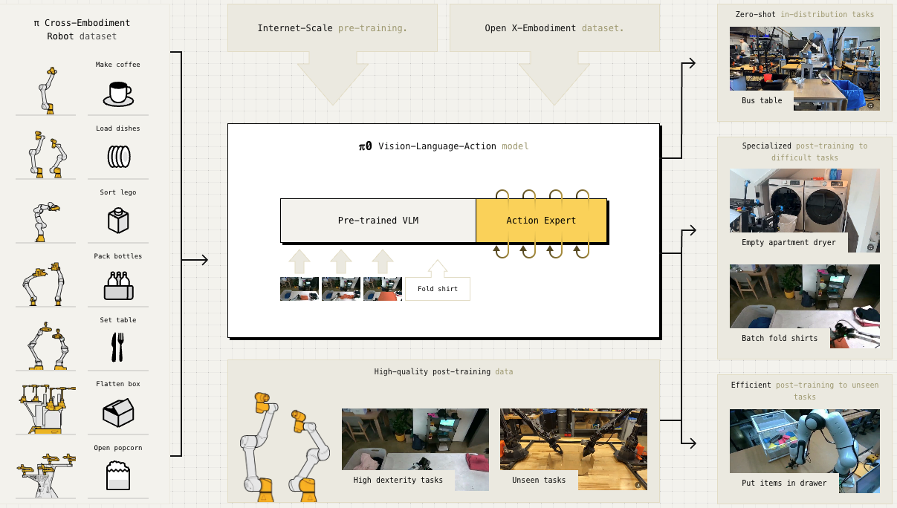

## 핵심 의의

- **Flow Matching의 성공적 적용**: Diffusion 대안으로 flow matching을 로봇에 처음 성공적으로 적용
- **VLM 지식의 로봇 전이**: PaliGemma(3B) VLM의 인터넷 스케일 지식을 dexterous manipulation에 활용
- **50Hz 고주파 제어**: Action Chunking으로 초당 50회 모터 명령 생성
- **8개 로봇 플랫폼**: 단일 암, 양팔, 모바일 매니퓰레이터 등 다양한 embodiment에서 학습
- **OpenVLA/Octo 압도**: 복잡한 dexterous 태스크에서 기존 오픈소스 VLA 대비 압도적 성능
- **오픈소스 공개**: openpi로 가중치, 학습 코드, JAX/PyTorch 구현 전체 공개


<p align="center"><em>π0 아키텍처: PaliGemma VLM + Flow Matching Action Expert</em></p>

---

## Overview

π0(pi-zero)는 Physical Intelligence가 8개월 개발 끝에 2024년 10월 발표한 첫 번째 범용 로봇 파운데이션 모델입니다. Google DeepMind의 RT 시리즈를 이끌었던 연구자들이 창업하여, Flow Matching 기반의 새로운 VLA 패러다임을 제시했습니다.

| 항목 | 내용 |
|------|------|
| 발표 | 2024년 10월 31일 |
| 회사 | Physical Intelligence |
| 논문 | [arXiv:2410.24164](https://arxiv.org/abs/2410.24164) |
| 블로그 | [pi.website/blog/pi0](https://www.pi.website/blog/pi0) |
| GitHub | [Physical-Intelligence/openpi](https://github.com/Physical-Intelligence/openpi) |

---

## Architecture

π0는 **VLM + Flow Matching Action Expert** 하이브리드 구조입니다.

```
┌─────────────────────────────────────────────────────────────┐
│                      π0 Architecture                         │
├─────────────────────────────────────────────────────────────┤
│                                                              │
│   ┌────────────────────────────────────────────────────┐    │
│   │              PaliGemma VLM (3B)                    │    │
│   │         Internet-scale Semantic Knowledge          │    │
│   │    • 이미지 이해    • 언어 지시 처리               │    │
│   └───────────────────────┬────────────────────────────┘    │
│                           │                                  │
│                           ▼                                  │
│   ┌────────────────────────────────────────────────────┐    │
│   │            Action Expert (+300M)                   │    │
│   │    • Proprioceptive states 처리                    │    │
│   │    • Action tokens 간 양방향 어텐션                │    │
│   │    • 별도 Transformer 가중치                       │    │
│   └───────────────────────┬────────────────────────────┘    │
│                           │                                  │
│                           ▼                                  │
│   ┌────────────────────────────────────────────────────┐    │
│   │              Flow Matching                         │    │
│   │    • 연속 action distribution 생성                 │    │
│   │    • Multimodal action 처리                        │    │
│   │    • 50Hz 고주파 제어                              │    │
│   └────────────────────────────────────────────────────┘    │
│                                                              │
└─────────────────────────────────────────────────────────────┘
```

### Model Specifications

| 구성 요소 | 사양 |
|----------|------|
| VLM Backbone | PaliGemma (3B) |
| Action Expert | +300M 파라미터 |
| 총 파라미터 | ~3.3B |
| 제어 주파수 | 50Hz |
| Action Horizon | 50 steps (1초) |

### Flow Matching이란?

Diffusion의 대안으로, 연속 분포를 모델링하는 방법:

| 특징 | 설명 |
|------|------|
| 연속 분포 | 복잡한 multimodal action distribution 처리 |
| 효율성 | Diffusion 대비 빠른 샘플링 |
| Transformer 통합 | VLM과 자연스러운 결합 |
| 고주파 제어 | Action chunk 생성에 적합 |

### Action Expert

VLM과 별도로 로봇 제어를 담당하는 모듈:

- **300M 추가 파라미터**: 별도의 Transformer 가중치
- **Proprioceptive 처리**: 로봇 상태 정보 인코딩
- **양방향 어텐션**: Action 토큰 간 일관성 확보
- **연속 출력**: Flow matching으로 연속 명령 생성

---

## Training Data

### π Dataset

Physical Intelligence가 직접 수집한 dexterous manipulation 데이터:

| 항목 | 내용 |
|------|------|
| 총 데이터 | 10,000+ 시간 |
| 로봇 플랫폼 | 8개 |
| 태스크 | 68개 |

### 지원 로봇 플랫폼

| 로봇 | 타입 |
|------|------|
| UR5e | 단일 암 |
| Bimanual UR5e | 양팔 |
| Franka | 단일 암 |
| Bimanual Trossen | 양팔 |
| Bimanual ARX | 양팔 |
| Mobile Trossen | 모바일 매니퓰레이터 |
| Mobile Fibocom | 모바일 매니퓰레이터 |

### 태스크 예시

- 빨래 접기 (laundry folding)
- 커피 준비 (coffee preparation)
- 식료품 봉지 담기 (grocery bagging)
- 테이블 정리 (table bussing)
- 케이블 정리 (cable routing)
- 박스 조립 (box assembly)
- 전원 플러그 삽입 (power plug insertion)

### 외부 데이터

- **Open X-Embodiment (OXE)**: 다양한 로봇 데이터 포함
- **인터넷 사전학습**: PaliGemma VLM을 통한 시각-언어 지식

---

## Performance

### vs OpenVLA, Octo (Zero-shot)

복잡한 multi-stage dexterous 태스크에서 비교:

| 태스크 | π0 | π0-Small | OpenVLA | Octo |
|--------|-----|----------|---------|------|
| Bussing Easy (UR5e) | **97.1%** | 44.3% | 0% | 4.3% |
| Bussing Hard (UR5e) | **87.5%** | 33.3% | 0% | 0% |
| Shirt Folding (Bi-ARX) | **100%** | 50% | 0% | 0% |
| Grocery Bagging (UR5e) | **78.6%** | 27.1% | 0% | 0% |
| Toast from Toaster | **75%** | 0% | 0% | 0% |

### VLM Pre-training의 효과

| 비교 | 결과 |
|------|------|
| π0 (full) vs π0-Small | **2배 이상 성능 향상** |
| 원인 | VLM 사전학습의 시각-언어 지식 |

### 핵심 인사이트

- **OpenVLA/Octo는 0%**: 복잡한 dexterous 태스크에서 실패
- **π0만 성공**: Flow matching + VLM 조합의 효과
- **일반화 능력**: 다양한 로봇에서 일관된 성능

---

## Capabilities

### Zero-shot 수행

사전학습만으로 바로 수행 가능한 태스크:

- 학습 환경과 유사한 설정에서의 조작
- 언어 지시 따르기
- 기본적인 물체 조작

### Fine-tuning 후 수행

소량의 추가 데이터로 전문화:

| 태스크 | 필요 데이터 |
|--------|------------|
| 빨래 접기 | ~수 시간 |
| 박스 조립 | ~수 시간 |
| 복잡한 조작 | 1-20시간 |

### 적응적 행동

- 인간 개입 시 복구
- 실패 후 재시도
- 다양한 물체 형태 대응

---

## Deployment Modes

### 1. Zero-shot

```
언어 지시 → π0 → 로봇 액션
```

- 추가 학습 없이 바로 사용
- 학습 분포 내 태스크에 적합

### 2. Fine-tuning

```
소량 시연 데이터 → π0 파인튜닝 → 전문화된 π0
```

- 1-20시간 데이터로 충분
- 새로운 태스크/환경에 적응

### 3. Language-Conditioned

```
고수준 VLM 계획 → π0 실행
```

- 외부 VLM이 고수준 계획 생성
- π0는 저수준 실행 담당

---

## Open Source Release

2025년 2월 openpi 저장소를 통해 공개:

### 공개 모델

| 모델 | 설명 |
|------|------|
| π0 base | 사전학습 모델, 파인튜닝용 |
| π0-FAST base | FAST 토크나이저 적용 (5x 빠른 학습) |
| π0 DROID | Franka 단일 암 파인튜닝 |
| π0 ALOHA | 양팔 조작 파인튜닝 |
| π0 Libero | 시뮬레이션 환경 파인튜닝 |

### 제공 리소스

- JAX 원본 구현
- PyTorch 구현 (HuggingFace LeRobot)
- 파인튜닝 스크립트
- 추론 코드

### π0-FAST

FAST 토크나이저를 적용한 autoregressive 버전:

| 특징 | 내용 |
|------|------|
| 학습 속도 | 5배 빠름 |
| 언어 이해 | 더 나은 instruction following |
| 추론 비용 | 4-5배 높음 |

---

## Variants

| 변형 | 방식 | 특징 |
|------|------|------|
| **π0** | Flow Matching | 빠른 추론, 연속 액션 |
| **π0-FAST** | Autoregressive | 빠른 학습, 더 나은 언어 이해 |
| **π0-Small** | Flow Matching | VLM 없음, 경량 |

---

## Subsequent Versions

π0 이후 발전된 버전들:

| 버전 | 발표 | 핵심 개선 |
|------|------|----------|
| [π0.5](pi0-5.md) | 2025.04 | Open-world 일반화 |
| [π*0.6](pi0-6-star.md) | 2025.11 | RL 자가 개선 |

전체 시리즈 개요: [π Series](pi-series.md)

---

## References

- [Physical Intelligence Blog - π0](https://www.pi.website/blog/pi0)
- [arXiv Paper](https://arxiv.org/abs/2410.24164)
- [GitHub - openpi](https://github.com/Physical-Intelligence/openpi)
- [Open Sourcing π0](https://www.pi.website/blog/openpi)
- [HuggingFace Blog](https://huggingface.co/blog/pi0)

---

## See Also

- [π Series](pi-series.md)
- [π0.5](pi0-5.md)
- [π*0.6](pi0-6-star.md)
- [Physical Intelligence](../companies/physical-intelligence.md)
- [Diffusion Policy](diffusion-policy.md)

### 관련 인물
- [Karol Hausman](../people/karol-hausman.md) - Physical Intelligence 공동창업자
- [Chelsea Finn](../people/chelsea-finn.md) - Physical Intelligence 공동창업자
- [Sergey Levine](../people/sergey-levine.md) - Physical Intelligence 공동창업자
- [Pete Florence](../people/pete-florence.md) - Physical Intelligence 공동창업자

