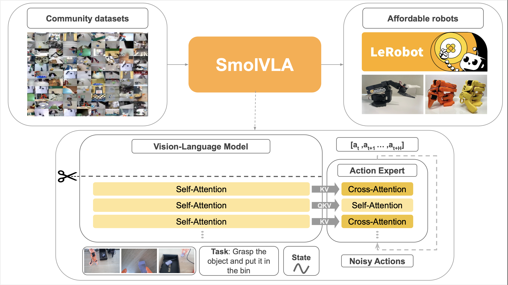

# SmolVLA

> Home > Models > SmolVLA

---

## 핵심 의의

- **극한의 효율성**: 450M 파라미터로 7배 큰 π0(3.3B)와 동등한 LIBERO 벤치마크 성능 (87.3%)
- **어디서나 실행 가능**: MacBook, consumer GPU, CPU에서도 동작 - VLA 연구의 진입 장벽 대폭 하락
- **커뮤니티 데이터만 사용**: 487개 LeRobot 커뮤니티 데이터셋(10M 프레임)으로 학습, 공개 데이터만으로 SOTA 달성
- **비동기 추론**: 액션 예측과 실행 분리로 30% 빠른 응답, 2배 처리량
- **빠른 학습**: A100 1대에서 4시간(20K steps)이면 학습 완료
- **Flow Matching 적용**: SmolVLM-2 + Flow Matching Action Expert 구조
- **완전 재현 가능**: 오픈소스 모델, 코드, 공개 데이터셋만 사용하여 누구나 재현 가능


<p align="center"><em>SmolVLA: 450M 파라미터로 π0 수준 성능 달성</em></p>

---

## Overview

SmolVLA는 HuggingFace가 개발한 경량 VLA 모델로, 450M 파라미터로 10배 큰 모델과 동등하거나 더 나은 성능을 보입니다. Consumer GPU와 MacBook에서도 실행 가능하며, LeRobot 커뮤니티 데이터로 학습되었습니다.

| 항목 | 내용 |
|------|------|
| 발표 | 2025년 6월 |
| 개발 | HuggingFace |
| 파라미터 | 450M |
| 논문 | [arXiv:2506.01844](https://arxiv.org/html/2506.01844v1) |
| 블로그 | [huggingface.co/blog/smolvla](https://huggingface.co/blog/smolvla) |
| 모델 | [lerobot/smolvla_base](https://huggingface.co/lerobot/smolvla_base) |

---

## Architecture

SmolVLA = **SmolVLM-2 (VLM)** + **Flow Matching Action Expert**

```
┌─────────────────────────────────────────────────────────┐
│                  SmolVLA Architecture                   │
├─────────────────────────────────────────────────────────┤
│  Inputs:                                                │
│  ┌──────────┐  ┌──────────┐  ┌──────────┐              │
│  │ Multiple │  │ Robot    │  │ Language │              │
│  │ Camera   │  │ State    │  │ Instruct │              │
│  │ Views    │  │          │  │          │              │
│  └────┬─────┘  └────┬─────┘  └────┬─────┘              │
│       │             │             │                     │
│       └─────────────┴─────────────┘                     │
│                     │                                   │
│              ┌──────▼──────┐                           │
│              │  SmolVLM-2  │   Compact VLM             │
│              │  (Context)  │                           │
│              └──────┬──────┘                           │
│                     │                                   │
│              ┌──────▼──────┐                           │
│              │   Action    │   Flow Matching           │
│              │   Expert    │                           │
│              └──────┬──────┘                           │
│                     │                                   │
│              ┌──────▼──────┐                           │
│              │   Action    │                           │
│              │   Chunk     │                           │
│              └─────────────┘                           │
└─────────────────────────────────────────────────────────┘
```

---

## Training Data

| 항목 | 내용 |
|------|------|
| 데이터 | 10M 프레임 |
| 소스 | 487개 LeRobot 커뮤니티 데이터셋 |
| 에피소드 | <30K (다른 VLA 대비 1/10 수준) |
| 환경 | 연구실부터 가정까지 다양 |

---

## Performance

### 벤치마크 결과

**LIBERO 벤치마크:**

| 모델 | 파라미터 | 성공률 |
|------|---------|--------|
| **SmolVLA** | **0.45B** | **87.3%** |
| π0 | 3.3B | ~87% |

→ 7배 작은 모델로 동등한 성능

### 다른 비교

- ACT보다 우수 (시뮬레이션 및 실제 환경)
- LIBERO, Meta-World, SO100, SO101에서 검증

---

## Key Advantages

| 특징 | 설명 |
|------|------|
| **경량** | 450M 파라미터 (10배 작음) |
| **효율** | MacBook, CPU에서도 실행 가능 |
| **빠른 학습** | A100 1대에서 4시간 (20K steps) |
| **비동기 추론** | 30% 빠른 응답, 2배 처리량 |
| **오픈소스** | 모델, 코드, 데이터 전체 공개 |

---

## Asynchronous Inference

SmolVLA의 차별화된 기능: **액션 예측과 실행 분리**

- 저지연 제어
- 리소스 제한 환경에서도 실시간 작동
- 30% 응답 속도 향상
- 2배 태스크 처리량

---

## Hardware Requirements

| 환경 | 가능 여부 |
|------|----------|
| MacBook | O |
| Consumer GPU | O |
| CPU only | O |
| 학습 (A100 1대) | 4시간 |

---

## Impact

SmolVLA의 의의:
- **접근성**: 고가 인프라 없이 VLA 연구 가능
- **효율성**: 적은 데이터, 작은 모델로 SOTA 성능
- **커뮤니티**: LeRobot 생태계 발전에 기여
- **재현성**: 완전 오픈소스, 공개 데이터셋만 사용

---

## References

- [HuggingFace Blog](https://huggingface.co/blog/smolvla)
- [arXiv Paper](https://arxiv.org/html/2506.01844v1)
- [Model - smolvla_base](https://huggingface.co/lerobot/smolvla_base)
- [LeRobot Documentation](https://huggingface.co/docs/lerobot/en/smolvla)
- [TechCrunch Article](https://techcrunch.com/2025/06/04/hugging-face-says-its-new-robotics-model-is-so-efficient-it-can-run-on-a-macbook/)

---

## See Also

- [모델 목록](index.md)
- [HuggingFace](../companies/huggingface.md)
- [ACT](act.md)
- [pi0](pi0.md)
- [커뮤니티 드리븐 접근](../solutions/community-driven.md)

